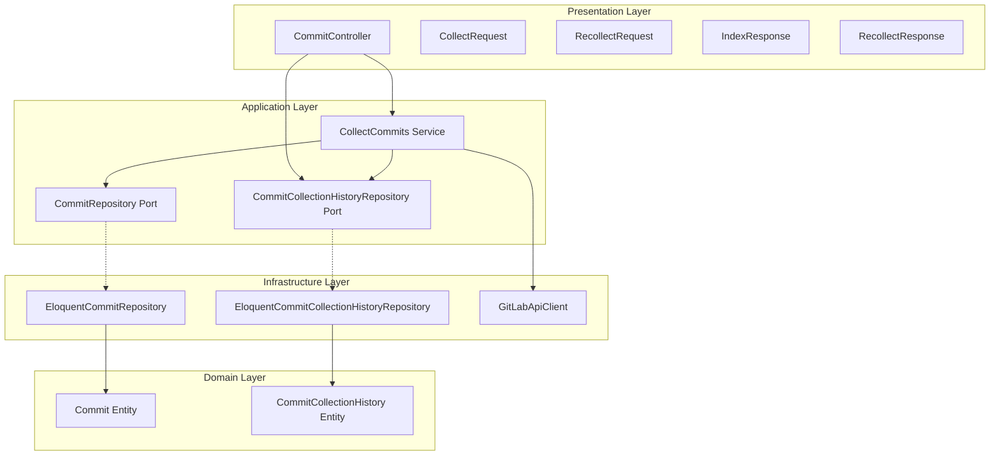
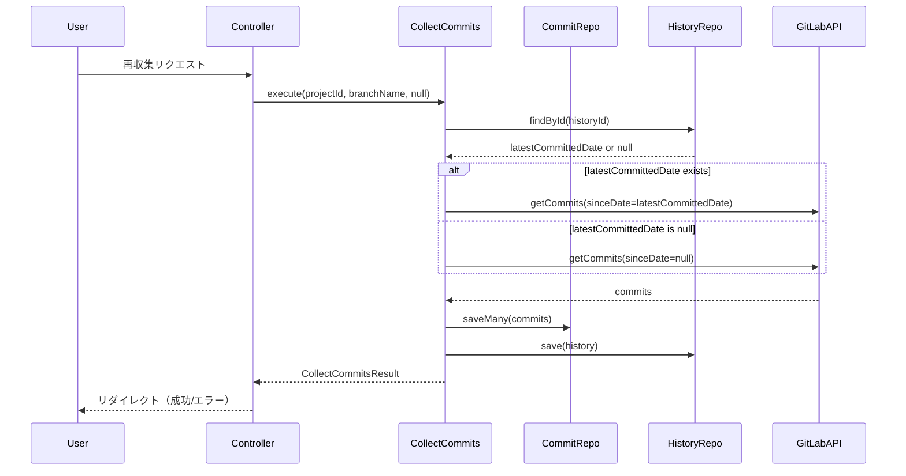

# Design Document

## Overview
この機能は、GitLabのコミット収集機能に増分収集機能を追加します。再収集時に前回収集した最新のコミット以降のコミットのみを収集することで、初回収集時は全コミットを収集し、2回目以降の収集時は前回の続きから最新までを効率的に収集できるようになります。

**Purpose**: この機能は、GitLabコミットの再収集を効率化し、不要な重複収集を避けることで、システムのパフォーマンスとリソース使用量を改善します。

**Users**: システム管理者と開発者が、プロジェクトとブランチごとのコミット収集履歴を確認し、必要に応じて再収集を実行できます。

**Impact**: 既存の`CollectCommits`サービスの動作を拡張し、新しい`CommitCollectionHistoryRepository`を追加し、再収集ページを新設します。

### Goals
- 前回収集した最新コミット日時以降のコミットのみを収集する増分収集機能を実装
- プロジェクトとブランチごとの収集履歴を記録・管理
- 再収集ページで収集履歴を一覧表示し、再収集を実行可能にする
- 既存のアーキテクチャパターンに準拠した実装

### Non-Goals
- コミット収集のスケジューリング機能（将来の拡張として検討）
- 複数プロジェクトの一括再収集機能（将来の拡張として検討）
- 収集履歴の削除機能（将来の拡張として検討）

## Architecture

### Existing Architecture Analysis
既存のシステムはクリーンアーキテクチャの原則に従って実装されています：

- **4層構造**: Domain, Application, Infrastructure, Presentation層が明確に分離
- **Ports and Adapters パターン**: `app/Application/Port/`にインターフェース、`app/Infrastructure/`に実装
- **BaseService パターン**: トランザクション管理とエラーハンドリングの統一パターン
- **Repository パターン**: `ConvertsBetweenEntityAndModel`トレイトによる共通実装

既存の`CollectCommits`サービスは`sinceDate`パラメータを受け取り、GitLab APIからコミットを取得してデータベースに保存します。現在の実装では、`sinceDate`が`null`の場合は全コミットを収集します。

この機能では、以下の2つの動作を追加します：
1. **自動判定機能**: `sinceDate`が`null`の場合、データベースから前回収集した最新コミット日時を自動的に取得し、その日時以降のコミットのみを収集する（増分収集）
2. **収集履歴の記録**: コミット収集完了後、収集したコミットの最新日時を`commit_collection_histories`テーブルに記録する

### Architecture Pattern & Boundary Map



**Architecture Integration**:
- **Selected pattern**: クリーンアーキテクチャ + Ports and Adapters パターン（既存パターンを維持）
- **Domain/feature boundaries**: 収集履歴は独立したドメイン概念として`CommitCollectionHistory`エンティティで表現
- **Existing patterns preserved**: BaseServiceパターン、Repositoryパターン、ConvertsBetweenEntityAndModelトレイト
- **New components rationale**: 
  - `CommitCollectionHistoryRepository`: 収集履歴の永続化を担当
  - `CommitCollectionHistory`エンティティ: 収集履歴のドメイン表現
- **Steering compliance**: 既存のクリーンアーキテクチャ原則、Ports and Adapters パターン、命名規則に準拠

### Technology Stack

| Layer | Choice / Version | Role in Feature | Notes |
|-------|------------------|-----------------|-------|
| Backend / Services | PHP 8.5.1, Laravel 12 | アプリケーションサービスとコントローラーの実装 | 既存のスタック |
| Data / Storage | PostgreSQL / MySQL | コミットと収集履歴の永続化 | 既存のデータベース |
| Frontend / CLI | React 19, TypeScript 5.7, Inertia.js 2.x | 再収集ページのUI実装 | 既存のスタック |
| Infrastructure / Runtime | Laravel Sail | 開発環境 | 既存の環境 |

## System Flows

### 増分収集の実行フロー



**Key Decisions**:
- `sinceDate`が`null`の場合、`CommitCollectionHistoryRepository`から最新日時を取得
- 最新日時が存在しない場合は全コミットを収集（初回収集）
- 収集完了後に収集履歴を更新

## Requirements Traceability

| Requirement | Summary | Components | Interfaces | Flows |
|-------------|---------|------------|------------|-------|
| 1.1 | 最新コミット日時の取得 | `CommitRepository`, `EloquentCommitRepository` | `findLatestCommittedDate()` | - |
| 1.2 | コミットが存在しない場合の処理 | `CommitRepository` | `findLatestCommittedDate()` returns null | - |
| 1.3 | 同じ日時のコミットの処理 | `CommitRepository` | `findLatestCommittedDate()` | - |
| 1.4 | インデックスの使用 | `EloquentCommitRepository` | データベースクエリ | - |
| 2.1 | 自動判定の実行 | `CollectCommits` | `execute()` | 増分収集フロー |
| 2.2 | 最新日時以降のコミット取得 | `CollectCommits`, `GitLabApiClient` | `getCommits()` | 増分収集フロー |
| 2.3 | 初回収集の処理 | `CollectCommits` | `execute()` | 増分収集フロー |
| 2.4 | 収集結果の返却 | `CollectCommits` | `execute()` returns `CollectCommitsResult` | - |
| 3.1 | `since`パラメータの設定 | `CollectCommits`, `GitLabApiClient` | `getCommits()` | 増分収集フロー |
| 3.2 | UTCタイムゾーンのフォーマット | `GitLabApiClient` | `fetchCommitsPage()` | - |
| 3.3 | 同じ日時のコミットの処理 | `CollectCommits` | `getCommits()` | - |
| 3.4 | 既存レコードの更新 | `CommitRepository` | `saveMany()` | - |
| 3.5 | コミットの保存 | `CollectCommits`, `CommitRepository` | `saveMany()` | - |
| 4.1 | エラー時のフォールバック | `CollectCommits` | `execute()` | - |
| 4.2 | 初回収集として扱う | `CollectCommits` | `execute()` | - |
| 4.3 | GitLab APIエラーの処理 | `CollectCommits` | `execute()` | - |
| 4.4 | データベースエラーの処理 | `CollectCommits`, `BaseService` | `transaction()` | - |
| 5.1 | 収集履歴の記録 | `CollectCommits`, `CommitCollectionHistoryRepository` | `save()` | - |
| 5.2 | 初回収集時のレコード作成 | `CommitCollectionHistoryRepository` | `save()` | - |
| 5.3 | 既存レコードの更新 | `CommitCollectionHistoryRepository` | `save()` | - |
| 5.4 | 履歴データの保存 | `CommitCollectionHistoryRepository` | `save()` | - |
| 5.5 | 一意性の保証 | `CommitCollectionHistoryRepository` | データベース制約 | - |
| 6.1 | 履歴の取得 | `CommitCollectionHistoryRepository` | `findById()` | - |
| 6.2 | 履歴が存在しない場合 | `CommitCollectionHistoryRepository` | `findById()` returns null | - |
| 6.3 | 全履歴の取得 | `CommitCollectionHistoryRepository` | `findAll()` | - |
| 7.1 | 再収集ページの表示 | `CommitController`, `RecollectShowRequest` | `recollectShow()` — 収集履歴テーブルから履歴を取得 | - |
| 7.2 | データの準備 | `CommitController`, `RecollectResponse` | `recollectShow()` | - |
| 7.3 | 履歴が存在しない場合の処理 | `CommitController`, `RecollectResponse` | `recollectShow()` | - |
| 7.4 | リストアイテムの表示 | `Recollect` page | UI component | - |
| 7.5 | 最新日時の表示 | `Recollect` page | UI component | - |
| 7.6 | 再収集ボタンの表示 | `Recollect` page | UI component | - |
| 8.1 | 再収集の実行 | `CommitController` | `recollect()` — `RecollectRequest`でバリデーション | 増分収集フロー |
| 8.2 | 前回日時以降のコミット収集 | `CollectCommits` | `execute()` | 増分収集フロー |
| 8.3 | 日時が存在する場合の処理 | `CollectCommits` | `execute()` | 増分収集フロー |
| 8.4 | 日時が存在しない場合の処理 | `CollectCommits` | `execute()` | 増分収集フロー |
| 8.5 | 履歴の更新 | `CollectCommits` | `execute()` | - |
| 8.6 | 成功時のリダイレクト | `CommitController` | `recollect()` | - |
| 8.7 | エラー時のリダイレクト | `CommitController` | `recollect()` | - |

## Components and Interfaces

| Component | Domain/Layer | Intent | Req Coverage | Key Dependencies (P0/P1) | Contracts |
|-----------|--------------|--------|--------------|--------------------------|-----------|
| `CommitRepository` | Application/Port | コミットの永続化と最新日時取得 | 1.1-1.4 | - | Service |
| `EloquentCommitRepository` | Infrastructure | `CommitRepository`の実装 | 1.1-1.4 | `CommitEloquentModel` (P0) | Service |
| `CommitCollectionHistoryRepository` | Application/Port | 収集履歴の永続化 | 5.1-5.5, 6.1-6.3 | - | Service |
| `EloquentCommitCollectionHistoryRepository` | Infrastructure | `CommitCollectionHistoryRepository`の実装 | 5.1-5.5, 6.1-6.3 | `CommitCollectionHistoryEloquentModel` (P0) | Service |
| `CollectCommits` | Application/Service | コミット収集のオーケストレーション | 2.1-2.4, 3.1-3.5, 4.1-4.4, 5.1-5.3, 8.2-8.5 | `CommitRepository` (P0), `CommitCollectionHistoryRepository` (P0), `GitApi` (P0), `ProjectRepository` (P0) | Service |
| `CommitController` | Presentation | HTTPリクエストの処理とUI表示 | 7.1-7.3, 8.1, 8.6-8.7 | `CollectCommits` (P0), `CommitCollectionHistoryRepository` (P0), `ProjectRepository` (P0) | API |
| `RecollectShowRequest` | Presentation | 再収集ページ表示リクエストの処理 | 7.1 | `Request` (P0) | State |
| `RecollectResponse` | Presentation | 再収集ページ用のデータ準備 | 7.2, 7.3 | `CommitCollectionHistory` (P0), `Project` (P0) | State |
| `RecollectRequest` | Presentation | 再収集リクエストのバリデーション | 8.1 | `Request` (P0) | State |
| `Recollect` page | Presentation/Frontend | 再収集ページのUI | 7.4-7.6 | Inertia.js (P0) | State |

### Application Layer

#### CommitRepository (Port)

| Field | Detail |
|-------|--------|
| Intent | コミットの永続化と最新コミット日時の取得を提供するポート |
| Requirements | 1.1, 1.2, 1.3, 1.4 |

**Responsibilities & Constraints**
- コミットの保存と更新
- 指定されたプロジェクトIDとブランチ名で最新コミット日時を取得
- コミット日時のインデックスを使用して効率的にクエリを実行

**Dependencies**
- Outbound: `Commit` エンティティ — ドメイン表現 (P0)

**Contracts**: Service [✓]

##### Service Interface
```php
interface CommitRepository {
    public function save(Commit $commit): Commit;
    public function saveMany(Collection<int, Commit> $commits): void;
    public function findLatestCommittedDate(ProjectId $projectId, BranchName $branchName): ?\DateTime;
}
```
- Preconditions: `$projectId`と`$branchName`が有効な値オブジェクト
- Postconditions: 最新コミット日時が返される、またはコミットが存在しない場合は`null`が返される
- Invariants: 返される日時は指定されたプロジェクトとブランチに一致するコミットのうち最も新しい日時

#### CommitCollectionHistoryRepository (Port)

| Field | Detail |
|-------|--------|
| Intent | 収集履歴の永続化を提供するポート |
| Requirements | 5.1, 5.2, 5.3, 5.4, 5.5, 6.1, 6.2, 6.3 |

**Responsibilities & Constraints**
- プロジェクトID、ブランチ名、最新コミット日時を保存
- プロジェクトIDとブランチ名の組み合わせで一意性を保証
- 指定されたプロジェクトIDとブランチ名で履歴を取得
- すべての履歴を取得

**Dependencies**
- Outbound: `CommitCollectionHistory` エンティティ — ドメイン表現 (P0)

**Contracts**: Service [✓]

##### Service Interface
```php
interface CommitCollectionHistoryRepository {
    public function save(CommitCollectionHistory $history): CommitCollectionHistory;
    public function findById(CommitCollectionHistoryId $id): ?CommitCollectionHistory;
    public function findAll(): Collection<int, CommitCollectionHistory>;
}
```
- Preconditions: `$id`が有効な`CommitCollectionHistoryId`値オブジェクト（`projectId`と`branchName`を含む）
- Postconditions: 履歴が保存または更新される、または取得される
- Invariants: プロジェクトIDとブランチ名の組み合わせで一意性が保証される

#### CollectCommits (Service)

| Field | Detail |
|-------|--------|
| Intent | コミット収集のオーケストレーションと増分収集の自動判定 |
| Requirements | 2.1, 2.2, 2.3, 2.4, 3.1, 3.3, 3.5, 4.1, 4.2, 4.3, 4.4, 5.1, 5.2, 5.3, 8.2, 8.3, 8.4, 8.5 |

**Responsibilities & Constraints**
- プロジェクトとブランチを指定してコミットを収集・永続化
- `sinceDate`が`null`の場合、`CommitCollectionHistoryRepository`から最新日時を取得して自動判定
- 収集完了後に収集履歴を更新
- トランザクション管理とエラーハンドリング

**Dependencies**
- Inbound: `ProjectRepository` — プロジェクト存在検証 (P0)
- Inbound: `GitApi` — コミット取得とブランチ検証 (P0)
- Inbound: `CommitRepository` — コミット永続化 (P0)
- Inbound: `CommitCollectionHistoryRepository` — 履歴管理 (P0)

**Contracts**: Service [✓]

##### Service Interface
```php
interface CollectCommits {
    public function execute(
        ProjectId $projectId,
        BranchName $branchName,
        ?\DateTime $sinceDate = null
    ): CollectCommitsResult;
}
```
- Preconditions: `$projectId`と`$branchName`が有効な値オブジェクト
- Postconditions: コミットが収集され、データベースに保存され、収集履歴が更新される
- Invariants: `sinceDate`が`null`の場合、自動判定が実行される

**Implementation Notes**
- Integration: `BaseService`を継承し、`transaction()`メソッドを使用
- Validation: プロジェクト存在検証とブランチ検証を実行
- Risks: `sinceDate`が`null`の場合の動作変更が既存の呼び出し元に影響する可能性（既存のテストで検証）

### Infrastructure Layer

#### EloquentCommitRepository

| Field | Detail |
|-------|--------|
| Intent | `CommitRepository`のEloquent実装 |
| Requirements | 1.1, 1.2, 1.3, 1.4 |

**Responsibilities & Constraints**
- `ConvertsBetweenEntityAndModel`トレイトを使用してエンティティとモデルの変換
- `committed_date`インデックスを使用して効率的にクエリを実行

**Dependencies**
- Outbound: `CommitEloquentModel` — データベースアクセス (P0)

**Contracts**: Service [✓]

**Implementation Notes**
- Integration: `ConvertsBetweenEntityAndModel`トレイトを使用
- Validation: プロジェクトIDとブランチ名でフィルタリング
- Risks: クエリパフォーマンス（インデックスが既に存在するため問題なし）

#### EloquentCommitCollectionHistoryRepository

| Field | Detail |
|-------|--------|
| Intent | `CommitCollectionHistoryRepository`のEloquent実装 |
| Requirements | 5.1, 5.2, 5.3, 5.4, 5.5, 6.1, 6.2, 6.3 |

**Responsibilities & Constraints**
- `ConvertsBetweenEntityAndModel`トレイトを使用してエンティティとモデルの変換
- 複合ユニーク制約により一意性を保証

**Dependencies**
- Outbound: `CommitCollectionHistoryEloquentModel` — データベースアクセス (P0)

**Contracts**: Service [✓]

**Implementation Notes**
- Integration: `ConvertsBetweenEntityAndModel`トレイトを使用
- Validation: プロジェクトIDとブランチ名で一意性を保証
- Risks: データ整合性（複合ユニーク制約で保証）

### Presentation Layer

#### CommitController

| Field | Detail |
|-------|--------|
| Intent | コミット収集と再収集のHTTPリクエスト処理 |
| Requirements | 7.1, 7.2, 7.3, 8.1, 8.6, 8.7 |

**Responsibilities & Constraints**
- 再収集ページの表示: `CommitCollectionHistoryRepository::findAll()`で収集履歴を取得し、プロジェクト情報と結合して表示
- 再収集リクエストの処理
- エラーハンドリングとフラッシュメッセージの設定

**Dependencies**
- Inbound: `CollectCommits` — コミット収集実行 (P0)
- Inbound: `CommitCollectionHistoryRepository` — 履歴取得 (P0)
- Inbound: `ProjectRepository` — プロジェクト取得（履歴に含まれるプロジェクトIDに対応するプロジェクト名を取得） (P0)

**Contracts**: API [✓]

##### API Contract
| Method | Endpoint | Request | Response | Errors |
|--------|----------|---------|----------|--------|
| GET | `/commits/recollect` | - | Inertia.js page (`RecollectResponse`) | 500 |
| POST | `/commits/recollect` | `RecollectRequest` | Redirect | 400, 500 |

**Implementation Notes**
- Integration: `BaseController`を継承し、`renderWithErrorHandling()`メソッドを使用
- Method Separation:
  - `collectShow()` (GET): `CollectShowResponse`を使用してデータを準備し、Inertia.jsページを表示（既存の`index()`をリネーム、Requestクラスは使用しない）
  - `collect()` (POST): `CollectRequest`でバリデーションし、収集を実行してリダイレクト
  - `recollectShow()` (GET): `RecollectShowRequest`でリクエストを処理し、`RecollectResponse`を使用してデータを準備し、Inertia.jsページを表示
  - `recollect()` (POST): `RecollectRequest`でバリデーションし、再収集を実行してリダイレクト
- Naming Consistency: アクションベースの命名パターンで完全に統一（`collectShow()` / `collect()` + `recollectShow()` / `recollect()`）
- Data Preparation: `CommitCollectionHistoryRepository::findAll()`で収集履歴を取得し、`RecollectResponse`でプロジェクト情報と結合
- Risks: エラーハンドリングの一貫性（既存のパターンに従う）

#### RecollectShowRequest

| Field | Detail |
|-------|--------|
| Intent | 再収集ページ表示リクエストの処理（既存の`ListRequest`パターンに準拠） |
| Requirements | 7.1 |

**Responsibilities & Constraints**
- GETリクエストの処理（現時点ではバリデーションルールは不要）
- 将来の拡張（フィルタリング、ページネーションなど）に対応できる構造

**Dependencies**
- Inbound: `Request` — HTTPリクエスト (P0)

**Contracts**: State [✓]

##### Implementation Pattern
```php
class RecollectShowRequest extends BaseRequest
{
    /**
     * バリデーションルールを取得
     *
     * @return array<string, mixed>
     */
    public function rules(): array
    {
        // GETリクエストなので、現時点ではバリデーションルールは不要
        return [];
    }
}
```

**Implementation Notes**
- Integration: 既存の`ListRequest`パターンに従う
- Validation: `BaseRequest`を継承し、`rules()`メソッドでバリデーションルールを定義（現時点では空配列）
- Usage: `CommitController::recollectShow()` (GET) メソッド内でのみ使用
- Future Extensibility: 将来、フィルタリングやページネーションが必要になった場合に拡張可能

#### RecollectResponse

| Field | Detail |
|-------|--------|
| Intent | 再収集ページ用のデータを準備するResponseクラス |
| Requirements | 7.2, 7.3 |

**Responsibilities & Constraints**
- `CommitCollectionHistory`のコレクションと`Project`のコレクションを受け取り、結合してフロントエンド用の配列に変換
- プロジェクト名（`project_name_with_namespace`）を履歴データに追加
- 履歴が存在しない場合は空配列を返す

**Dependencies**
- Inbound: `Collection<int, CommitCollectionHistory>` — 収集履歴 (P0)
- Inbound: `Collection<int, Project>` — プロジェクト情報（プロジェクト名の取得用） (P0)

**Contracts**: State [✓]

##### Implementation Pattern
```php
class RecollectResponse
{
    /**
     * @param  Collection<int, CommitCollectionHistory>  $histories
     * @param  Collection<int, Project>  $projects
     */
    public function __construct(
        private readonly Collection $histories,
        private readonly Collection $projects
    ) {}

    /**
     * Inertia.jsに渡すための配列に変換
     *
     * @return array<string, mixed>
     */
    public function toArray(): array
    {
        // プロジェクトIDをキーとしたマップを作成
        $projectMap = $this->projects->keyBy(fn (Project $project) => $project->id->value);
        
        // 履歴を配列に変換し、プロジェクト名を追加
        $historiesArray = $this->histories->map(function (CommitCollectionHistory $history) use ($projectMap) {
            $project = $projectMap->get($history->projectId->value);
            
            return [
                'project_id' => $history->projectId->value,
                'project_name_with_namespace' => $project?->nameWithNamespace->value ?? 'Unknown',
                'branch_name' => $history->branchName->value,
                'latest_committed_date' => $history->latestCommittedDate->value->format('c'), // ISO 8601
            ];
        })->toArray();
        
        return [
            'histories' => $historiesArray,
        ];
    }
}
```

**Implementation Notes**
- Integration: 既存の`IndexResponse`パターンに従う
- Validation: プロジェクトが存在しない場合の処理（`Unknown`を表示、またはエラーをスロー）
- Risks: プロジェクトが削除された場合の処理（既存のプロジェクトが存在しない場合）
- Usage: `CommitController::recollectShow()` (GET) メソッド内で、`RecollectShowRequest`と共に使用

#### RecollectRequest

| Field | Detail |
|-------|--------|
| Intent | 再収集リクエストのバリデーションとデータ取得 |
| Requirements | 8.1 |

**Responsibilities & Constraints**
- `project_id`と`branch_name`のバリデーション
- 値オブジェクト（`ProjectId`、`BranchName`）への変換メソッドを提供

**Dependencies**
- Inbound: `Request` — HTTPリクエスト (P0)

**Contracts**: State [✓]

##### Implementation Pattern
```php
class RecollectRequest extends BaseRequest
{
    public function rules(): array
    {
        return [
            'project_id' => ['required', 'integer', 'exists:projects,id'],
            'branch_name' => ['required', 'string', 'max:255'],
        ];
    }

    public function getProjectId(): int
    {
        return (int) $this->request->input('project_id');
    }

    public function getBranchName(): string
    {
        return (string) $this->request->input('branch_name');
    }
}
```

**Implementation Notes**
- Integration: 既存の`CollectRequest`パターンに従う
- Validation: `BaseRequest`を継承し、`rules()`メソッドでバリデーションルールを定義
- Usage: `CommitController::recollect()` (POST) メソッド内でのみ使用

**Note**: `RecollectRequest`と`RecollectResponse`は異なるHTTPメソッド（POSTとGET）で使用されるため、同じアクションメソッド内では使用されません。

#### Recollect Page (Frontend)

| Field | Detail |
|-------|--------|
| Intent | 再収集ページのUI表示 |
| Requirements | 7.4, 7.5, 7.6 |

**Responsibilities & Constraints**
- プロジェクト名とブランチ名の組み合わせごとにリストアイテムを表示
- 各リストアイテムに前回の最新コミット日時を表示
- 各リストアイテムに「再収集」ボタンを表示

**Dependencies**
- Inbound: Inertia.js — ページレンダリング (P0)
- Inbound: `Table` コンポーネント — リスト表示 (P0)
- Inbound: `LoadingButton` コンポーネント — 再収集ボタン (P0)
- Inbound: `PageLayout` コンポーネント — ページレイアウト (P0)
- Inbound: `FlashMessage` コンポーネント — エラー/成功メッセージ (P0)

**Contracts**: State [✓]

##### UI Structure

**Page Layout**:
- `PageLayout`コンポーネントを使用し、タイトル「再収集」を表示
- `FlashMessage`でエラー/成功メッセージを表示

**List Display**:
- `Table`コンポーネントを使用してリストを表示
- テーブルヘッダー: 「プロジェクト名」「ブランチ名」「前回の最新日時」「操作」
- 各行は`(project_id, branch_name)`の組み合わせを表す

**List Item Structure**:
- **プロジェクト名**: `project_name_with_namespace`を表示（左揃え）
- **ブランチ名**: `branch_name`を表示（左揃え）
- **前回の最新日時**: 
  - `latest_committed_date`が存在する場合: 日時を表示（例: "2026-01-10 12:34:56"）
  - `latest_committed_date`が`null`の場合: "未収集"または"-"を表示（`text-muted-foreground`スタイル）
- **操作**: 「再収集」ボタン（`LoadingButton`コンポーネント、`RefreshCwIcon`アイコン）

**Empty State**:
- 収集履歴テーブルにレコードが存在しない場合: 中央揃えで「収集履歴が存在しません」を表示（`text-muted-foreground`スタイル）
- 既存の`Project/Index.tsx`の空状態パターンに従う
- 注意: すべてのプロジェクトとブランチの組み合わせではなく、収集履歴テーブルに存在するレコードのみを表示

**Button Behavior**:
- 各「再収集」ボタンは独立して動作
- クリック時に`POST /commits/recollect`に`project_id`と`branch_name`を送信
- 処理中は`loading`状態を表示（「再収集中...」）
- 処理完了後、成功/エラーメッセージを表示してページをリロード

**Date Format**:
- 日時は`YYYY-MM-DD HH:mm:ss`形式で表示
- タイムゾーンはサーバーのタイムゾーンに従う（またはUTCを明示）

**TypeScript Interface**:
```typescript
interface RecollectHistoryItem {
    project_id: number;
    project_name_with_namespace: string;
    branch_name: string;
    latest_committed_date: string; // ISO 8601 format (always present, not null)
}

interface RecollectPageProps extends BasePageProps {
    histories: RecollectHistoryItem[]; // 収集履歴テーブルに存在するレコードのみ
}
```

**Implementation Notes**
- Integration: 既存の`Project/Index.tsx`のテーブルパターンに従う
- Validation: 型安全性を確保（TypeScript）
- Risks: UI/UXの一貫性（既存のパターンに従う）
- Styling: Tailwind CSSクラスを使用（`rounded-md border`, `text-muted-foreground`など）

## Data Models

### Domain Model

**Aggregates**:
- `Commit`: コミットエンティティ（既存）
- `CommitCollectionHistory`: 収集履歴エンティティ（新規）

**Entities**:
- `CommitCollectionHistory`: プロジェクトID、ブランチ名、最新コミット日時を保持
  - 構造: `readonly class CommitCollectionHistory` with `ComparesProperties` trait
  - プロパティ:
    - `projectId: ProjectId` — プロジェクトID（値オブジェクト）
    - `branchName: BranchName` — ブランチ名（値オブジェクト）
    - `latestCommittedDate: CommittedDate` — 最新コミット日時（値オブジェクト）
  - パターン: 既存の`Commit`エンティティと同様に、`readonly class`で定義し、`ComparesProperties`トレイトを使用して等価性判定を実装

**Value Objects**:
- `ProjectId`: プロジェクトID（既存）
- `BranchName`: ブランチ名（既存）
- `CommittedDate`: コミット日時（既存）

**Business Rules & Invariants**:
- プロジェクトIDとブランチ名の組み合わせで一意性が保証される
- 最新コミット日時は、収集されたコミットのうち最も新しい日時

### Logical Data Model

**Structure Definition**:
- `commit_collection_histories`テーブル:
  - `project_id` (unsigned big integer, FK to projects.id)
  - `branch_name` (string, 255)
  - `latest_committed_date` (timestamp)
  - 複合ユニーク制約: `(project_id, branch_name)`

**Consistency & Integrity**:
- トランザクション境界: `CollectCommits::execute()`内でコミット保存と履歴更新を同一トランザクションで実行
- 参照整合性: `projects`テーブルへの外部キー制約
- 一意性: 複合ユニーク制約により、プロジェクトとブランチの組み合わせで一意性を保証

### Physical Data Model

**Table Definition**:
```sql
CREATE TABLE commit_collection_histories (
    project_id BIGINT UNSIGNED NOT NULL,
    branch_name VARCHAR(255) NOT NULL,
    latest_committed_date TIMESTAMP NOT NULL,
    PRIMARY KEY (project_id, branch_name),
    FOREIGN KEY (project_id) REFERENCES projects(id),
    INDEX idx_project_id (project_id),
    INDEX idx_latest_committed_date (latest_committed_date)
);
```

**Indexes**:
- プライマリキー: `(project_id, branch_name)` — 一意性と高速検索
- `idx_project_id`: プロジェクトIDでの検索を高速化
- `idx_latest_committed_date`: 日時での検索を高速化（将来の拡張用）

### Data Contracts & Integration

**API Data Transfer**:
- `RecollectShowRequest`: GETリクエスト（現時点ではパラメータなし、将来の拡張に対応）
- `RecollectRequest`: `project_id` (integer), `branch_name` (string)
- `RecollectResponse`: `histories` (array of `RecollectHistoryItem`)
  - `RecollectHistoryItem`: 
    - `project_id` (integer)
    - `project_name_with_namespace` (string) — プロジェクトが存在しない場合は`"Unknown"`
    - `branch_name` (string)
    - `latest_committed_date` (string) - ISO 8601形式（例: "2026-01-10T12:34:56Z"）
  - 注意: `histories`は`commit_collection_histories`テーブルに存在するレコードのみを含む（すべてのプロジェクトとブランチの組み合わせではない）

**Cross-Service Data Management**:
- `CollectCommits`サービス内でコミット保存と履歴更新を同一トランザクションで実行
- トランザクション失敗時はロールバック

## Error Handling

### Error Strategy
既存の`BaseService`パターンと`CollectCommits`サービスのエラーハンドリングパターンに従います。

### Error Categories and Responses

**User Errors** (4xx):
- 無効なプロジェクトIDまたはブランチ名 → バリデーションエラーを返す
- 存在しないプロジェクト → エラーメッセージを返す

**System Errors** (5xx):
- GitLab APIエラー → `GitLabApiException`をキャッチしてエラー結果を返す
- データベースエラー → トランザクションをロールバックしてエラー結果を返す
- 最新コミット日時取得エラー → フォールバック動作として全コミットを収集

**Business Logic Errors** (422):
- ブランチが存在しない → `GitLabApiException`をスロー

### Monitoring
- エラーログ: `CollectCommits`サービスでエラーをログに記録
- フラッシュメッセージ: コントローラーで成功/エラーメッセージを設定

## Testing Strategy

### Unit Tests
- `EloquentCommitRepository::findLatestCommittedDate()`: 最新コミット日時の取得をテスト
- `EloquentCommitCollectionHistoryRepository::save()`: 履歴の保存と更新をテスト
- `CollectCommits::execute()`: 増分収集の自動判定をテスト

### Integration Tests
- `CollectCommits`サービス: コミット収集と履歴更新の統合テスト
- `CommitController::recollectShow()`: 再収集ページの表示をテスト
- `CommitController::recollect()`: 再収集の実行をテスト

### E2E/UI Tests
- 再収集ページ: プロジェクトとブランチの組み合わせの表示をテスト
- 再収集ボタン: クリック時の動作をテスト

## Supporting References
詳細な調査結果と設計決定の根拠は`research.md`を参照してください。
