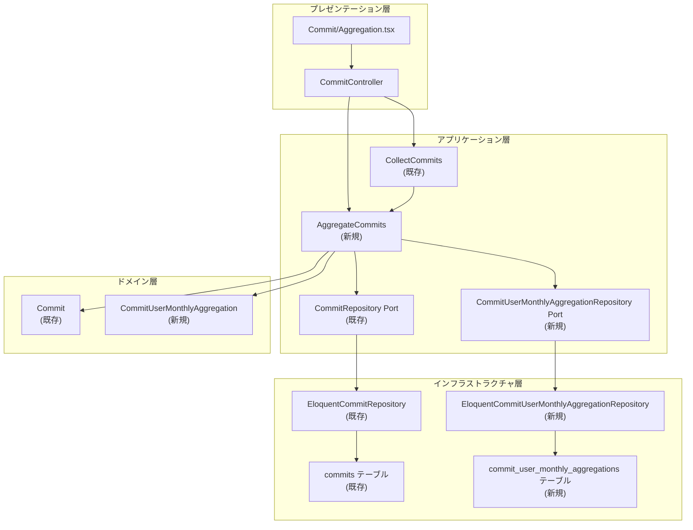
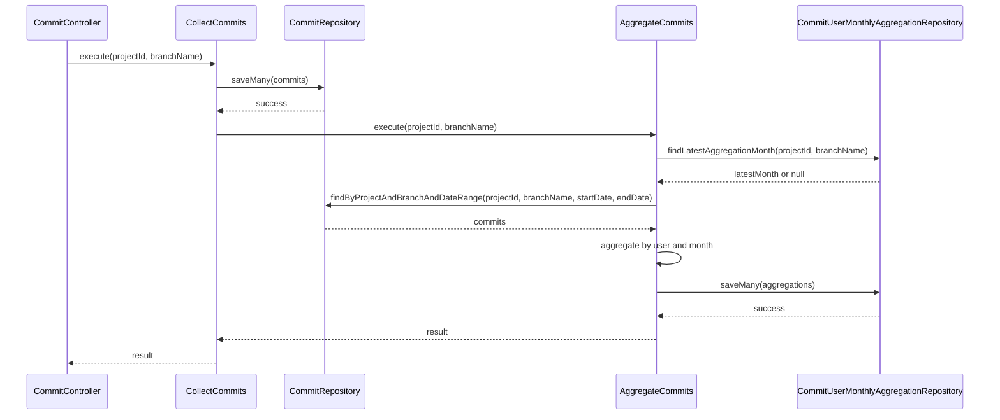

# Design Document: GitLab Commit User Monthly Aggregation

---
**Purpose**: Provide sufficient detail to ensure implementation consistency across different implementers, preventing interpretation drift.

**Approach**:
- Include essential sections that directly inform implementation decisions
- Omit optional sections unless critical to preventing implementation errors
- Match detail level to feature complexity
- Use diagrams and tables over lengthy prose
---

## Overview

本機能は、GitLabのコミットデータからユーザー（コミット作成者）ごとの月次集計（追加行数と削除行数）を生成し、永続化・表示する機能を提供します。既存のコミット収集機能を拡張し、集計データの管理と可視化を追加します。

**ユーザー**: システム管理者と分析担当者が、ユーザーの生産性を月単位で分析するために利用します。

**影響**: 既存の`CollectCommits`サービスに集計処理の自動実行を追加し、新規の集計データ管理機能と可視化UIを追加します。

### Goals
- コミットデータから月次集計を自動生成し、永続化する
- 集計データを効率的に取得・表示する
- ユーザーの生産性を視覚的に分析できるUIを提供する
- 既存のコミット収集機能と統合し、自動的に集計を実行する

### Non-Goals
- リアルタイムでの集計更新（コミット収集完了後のバッチ処理）
- 複数プロジェクト・ブランチの横断的な集計分析（将来の拡張として検討）
- 集計データの手動編集機能

## Architecture

### Existing Architecture Analysis

既存システムはクリーンアーキテクチャの4層構造を採用：
- **ドメイン層**: エンティティ、値オブジェクト（`Commit`, `Project`など）
- **アプリケーション層**: サービス、DTO、Port/Contract（`CollectCommits`, `CommitRepository`など）
- **インフラストラクチャ層**: リポジトリ実装、Eloquentモデル
- **プレゼンテーション層**: コントローラー、リクエスト/レスポンス

**統合ポイント**: `CollectCommits`サービスの完了後に集計処理を自動実行する必要がある。既存のインターフェースを変更せず、新規サービスを呼び出す形で統合する。

### Architecture Pattern & Boundary Map



**Architecture Integration**:
- **選択パターン**: クリーンアーキテクチャ（既存パターンに準拠）
- **ドメイン境界**: 集計機能は収集機能とは独立した責任を持つ。`AggregateCommits`サービスは新規コンポーネントとして実装し、`CollectCommits`から呼び出される。
- **既存パターンの維持**: BaseServiceパターン、リポジトリパターン（Port/Adapter）、ConvertsBetweenEntityAndModelトレイトを継続使用
- **新規コンポーネントの根拠**: 
  - `AggregateCommits`サービス: 集計ロジックの独立した責任
  - `CommitUserMonthlyAggregation`エンティティ: 集計データのドメインモデル
  - `CommitUserMonthlyAggregationRepository` Port: 集計データの永続化インターフェース
- **Steering準拠**: クリーンアーキテクチャの原則、型安全性、単一責任原則を維持

### Technology Stack

| Layer | Choice / Version | Role in Feature | Notes |
|-------|------------------|-----------------|-------|
| Frontend | Recharts 3.0+ | グラフ表示（積み上げ棒グラフ、集合縦棒グラフ） | React 19、TypeScript 5.x対応 |
| Frontend | Radix UI Select | セレクトボックス（プロジェクト・ブランチ、年） | 既存パターン |
| Backend | Laravel 12 | アプリケーションサービス、コントローラー | 既存スタック |
| Backend | PHP 8.5+ | 集計ロジック実装 | 既存スタック |
| Data | PostgreSQL | 集計データの永続化 | 既存スタック |
| Data | Eloquent ORM | データアクセス | 既存パターン |

詳細な選定根拠と比較は`research.md`を参照。

## System Flows

### 集計処理の自動実行フロー



**フローレベルの決定事項**:
- `CollectCommits`の完了後に`AggregateCommits`を呼び出す（要件4.1）
- 集計処理の失敗はエラーログのみ記録し、コミット保存処理は継続（要件4.6）
  - `CollectCommits::execute()`内で、コミット保存完了後に`AggregateCommits::execute()`を呼び出す際、try-catchで囲み、エラー時は`\Log::error()`でログに記録するのみで、`CollectCommitsResult`には影響を与えない
- 最終集計月から先月までのデータのみを集計（要件2.8-2.10）

## Requirements Traceability

| Requirement | Summary | Components | Interfaces | Flows |
|-------------|---------|------------|------------|-------|
| 1.1 | 集計データのキー設計 | CommitUserMonthlyAggregation, EloquentCommitUserMonthlyAggregationRepository | CommitUserMonthlyAggregationRepository::save() | - |
| 1.2 | 追加行数・削除行数の保存 | CommitUserMonthlyAggregation | - | - |
| 1.3 | 重複防止（更新） | EloquentCommitUserMonthlyAggregationRepository | CommitUserMonthlyAggregationRepository::save() | - |
| 1.4 | コミット数の記録 | CommitUserMonthlyAggregation | - | - |
| 1.5 | author_nameの保存 | CommitUserMonthlyAggregation | - | - |
| 1.6 | タイムゾーン考慮 | AggregateCommits | - | 集計処理フロー |
| 2.1-2.6 | 集計生成ロジック | AggregateCommits, CommitRepository | AggregateCommits::execute(), CommitRepository::findByProjectAndBranchAndDateRange() | 集計処理フロー |
| 2.7 | エラーハンドリング | AggregateCommits | AggregateCommits::execute() | 集計処理フロー |
| 2.8-2.10 | 集計範囲の判定 | AggregateCommits | - | 集計処理フロー |
| 2.11 | 自動実行トリガー | CollectCommits, AggregateCommits | - | 集計処理フロー |
| 3.1-3.5 | 集計データの取得 | CommitUserMonthlyAggregationRepository, CommitController | CommitUserMonthlyAggregationRepository::findByProjectAndBranch() | - |
| 4.1-4.6 | 自動更新ロジック | CollectCommits, AggregateCommits | - | 集計処理フロー |
| 5.1-5.12 | UI表示 | Commit/Aggregation.tsx, CommitController | CommitController::aggregationShow() | - |

## Components and Interfaces

| Component | Domain/Layer | Intent | Req Coverage | Key Dependencies (P0/P1) | Contracts |
|-----------|--------------|--------|--------------|--------------------------|-----------|
| CommitUserMonthlyAggregation | Domain | 月次集計データのエンティティ | 1.1-1.6 | - | - |
| AggregateCommits | Application | コミットデータから月次集計を生成 | 2.1-2.11, 4.1-4.6 | CommitRepository (P0), CommitUserMonthlyAggregationRepository (P0) | Service |
| CommitUserMonthlyAggregationRepository | Application/Port | 集計データの永続化インターフェース | 1.1-1.6, 3.1-3.5 | - | Service |
| CommitRepository (拡張) | Application/Port | コミットデータの永続化（既存に集計用メソッド追加） | 2.1-2.6 | - | Service |
| EloquentCommitUserMonthlyAggregationRepository | Infrastructure | 集計データのEloquent実装 | 1.1-1.6, 3.1-3.5 | Eloquent ORM (P0) | Service |
| CommitController::aggregationShow() | Presentation | 集計画面の表示 | 5.1-5.12 | CommitUserMonthlyAggregationRepository (P0), CommitCollectionHistoryRepository (P0), ProjectRepository (P1) | API |
| Commit/Aggregation.tsx | Presentation | 集計データの可視化UI | 5.1-5.12 | Recharts (P0), Radix UI (P0) | State |
| stories/Commit/Aggregation.stories.tsx | Presentation | 集計画面のStorybookストーリー | 5.1-5.12 | Commit/Aggregation.tsx (P0), Inertia.js mocks (P0) | - |

### Domain

#### CommitUserMonthlyAggregation

| Field | Detail |
|-------|--------|
| Intent | ユーザーごとの月次集計データを表現するエンティティ |
| Requirements | 1.1-1.6 |
| Owner / Reviewers | - |

**Responsibilities & Constraints**
- 月次集計データの不変性を保証（readonly class）
- `CommitUserMonthlyAggregationId`（project_id, branch_name, author_email, year, monthを含む）をキーとして一意性を保証
- 追加行数、削除行数、コミット数、author_nameを保持

**Dependencies**
- Inbound: AggregateCommitsサービス — 集計データの生成 (P0)
- Outbound: なし

**Contracts**: State [✓]

##### State Management
- State model: 不変エンティティ（readonly class）
- Persistence & consistency: リポジトリを通じて永続化、複合プライマリキーで一意性を保証
- Concurrency strategy: データベースレベルの一意制約で重複を防止

**Implementation Notes**
- Integration: `ConvertsBetweenEntityAndModel`トレイトを使用してEloquentモデルと変換
- Validation: 値オブジェクト（`AggregationYear`, `AggregationMonth`）で年・月の妥当性を保証
- Risks: タイムゾーン処理の正確性（要件1.6）

### Application

#### AggregateCommits

| Field | Detail |
|-------|--------|
| Intent | コミットデータから月次集計を生成し、永続化するサービス |
| Requirements | 2.1-2.11, 4.1-4.6 |
| Owner / Reviewers | - |

**Responsibilities & Constraints**
- 指定されたプロジェクト・ブランチのコミットデータから月次集計を生成
- 最終集計月から先月までのデータのみを集計（今月は除外）
- 既存集計月をスキップし、新規データのみを集計
- トランザクション内で集計データを保存（部分的な保存を防止）

**Dependencies**
- Inbound: CollectCommitsサービス — 集計処理のトリガー (P0)
- Outbound: CommitRepository — コミットデータの取得（日付範囲指定） (P0)
- Outbound: CommitUserMonthlyAggregationRepository — 集計データの保存・取得 (P0)

**Contracts**: Service [✓]

##### Service Interface
```php
interface AggregateCommits {
    public function execute(
        ProjectId $projectId,
        BranchName $branchName
    ): AggregateCommitsResult;
}
```
- Preconditions: プロジェクトIDとブランチ名が有効であること
- Postconditions: 最終集計月から先月までの集計データが保存される、またはエラーが返却される
- Invariants: 同一キーの集計データは更新され、重複は作成されない

**Implementation Notes**
- Integration: `BaseService`を継承し、`transaction()`メソッドでトランザクション管理
- Validation: 集計範囲の判定（最終集計月から先月まで）、タイムゾーン考慮
- CommitRepository拡張: 既存の`CommitRepository` Port（`app/Application/Port/CommitRepository.php`）に`findByProjectAndBranchAndDateRange(ProjectId $projectId, BranchName $branchName, \DateTime $startDate, \DateTime $endDate): Collection`メソッドを追加する必要がある。`EloquentCommitRepository`で実装し、`committed_date`が`$startDate`以上`$endDate`以下のコミットを取得する
- Risks: 大量データの集計処理のパフォーマンス（インデックス設計で対応）

#### CommitUserMonthlyAggregationRepository

| Field | Detail |
|-------|--------|
| Intent | 集計データの永続化を提供するポートインターフェース |
| Requirements | 1.1-1.6, 3.1-3.5 |
| Owner / Reviewers | - |

**Responsibilities & Constraints**
- 集計データの保存・更新（同一キーは更新）
- 集計データの取得（プロジェクト・ブランチ・年月範囲・ユーザーでフィルタリング）
- 最終集計月の取得

**Dependencies**
- Inbound: AggregateCommitsサービス — 集計データの保存 (P0)
- Inbound: CommitController — 集計データの取得 (P0)
- Outbound: Eloquent ORM — データアクセス (P0)

**Contracts**: Service [✓]

##### Service Interface
```php
interface CommitUserMonthlyAggregationRepository {
    public function save(CommitUserMonthlyAggregation $aggregation): CommitUserMonthlyAggregation;
    
    public function saveMany(Collection $aggregations): void;
    
    public function findLatestAggregationMonth(
        ProjectId $projectId,
        BranchName $branchName
    ): ?Carbon;
    
    public function findByProjectAndBranch(
        ProjectId $projectId,
        BranchName $branchName,
        ?int $year = null,
        ?array $months = null,
        ?string $authorEmail = null
    ): Collection;
}
```

**Implementation Notes**
- Integration: `ConvertsBetweenEntityAndModel`トレイトを使用
- Validation: 複合プライマリキーで一意性を保証
- Risks: クエリパフォーマンス（インデックス設計で対応）

### Infrastructure

#### CommitRepository (既存コンポーネントの拡張)

| Field | Detail |
|-------|--------|
| Intent | コミットデータの永続化を提供するポート（既存）に集計用メソッドを追加 |
| Requirements | 2.1-2.6 |
| Owner / Reviewers | - |

**Responsibilities & Constraints**
- 既存の`CommitRepository` Port（`app/Application/Port/CommitRepository.php`）に新規メソッドを追加
- 日付範囲でコミットデータを取得する機能を提供

**Dependencies**
- Inbound: AggregateCommitsサービス — 集計用コミットデータの取得要求 (P0)
- Outbound: Eloquent ORM — データアクセス (P0)

**Contracts**: Service [✓]

##### Service Interface (拡張)
```php
// 既存のCommitRepositoryインターフェースに追加
public function findByProjectAndBranchAndDateRange(
    ProjectId $projectId,
    BranchName $branchName,
    \DateTime $startDate,
    \DateTime $endDate
): Collection;
```
- Preconditions: プロジェクトID、ブランチ名、開始日、終了日が有効であること
- Postconditions: 指定された日付範囲内のコミットデータのコレクションを返却
- Invariants: `committed_date`が`$startDate`以上`$endDate`以下のコミットのみを取得

**Implementation Notes**
- Integration: 既存の`EloquentCommitRepository`に実装を追加
- Validation: 日付範囲の妥当性チェック（`$startDate <= $endDate`）
- Risks: 大量データのクエリパフォーマンス（`committed_date`インデックスで対応）

#### EloquentCommitUserMonthlyAggregationRepository

| Field | Detail |
|-------|--------|
| Intent | 集計データのEloquent実装 |
| Requirements | 1.1-1.6, 3.1-3.5 |
| Owner / Reviewers | - |

**Responsibilities & Constraints**
- `CommitUserMonthlyAggregationRepository` Portの実装
- Eloquentモデルとエンティティの変換
- データベースクエリの最適化（インデックス活用）

**Dependencies**
- Inbound: AggregateCommitsサービス — 集計データの保存要求 (P0)
- Inbound: CommitController — 集計データの取得要求 (P0)
- Outbound: CommitUserMonthlyAggregationEloquentModel — データアクセス (P0)
- Outbound: PostgreSQL — データ永続化 (P0)

**Contracts**: Service [✓]

**Implementation Notes**
- Integration: `ConvertsBetweenEntityAndModel`トレイトを使用してエンティティとEloquentモデルの変換を実装
- Validation: 複合プライマリキー制約でデータ整合性を保証
- Risks: 大量データのクエリパフォーマンス（インデックス設計で対応）

### Presentation

#### CommitController::aggregationShow()

| Field | Detail |
|-------|--------|
| Intent | 集計画面の表示とデータ取得 |
| Requirements | 5.1-5.12 |
| Owner / Reviewers | - |

**Responsibilities & Constraints**
- 集計画面のInertia.jsレスポンスを返却
- プロジェクト一覧、ブランチ一覧、年一覧を取得
- ブランチ一覧は`CommitCollectionHistoryRepository::findAll()`から取得し、プロジェクトとブランチの組み合わせを抽出（コミット履歴はプロジェクトとブランチで一意）
- 選択されたプロジェクト・ブランチ・年の集計データを取得

**Dependencies**
- Inbound: HTTPリクエスト — ユーザーリクエスト (P0)
- Outbound: CommitUserMonthlyAggregationRepository — 集計データの取得 (P0)
- Outbound: ProjectRepository — プロジェクト一覧の取得 (P1)
- Outbound: CommitCollectionHistoryRepository — ブランチ一覧の取得（コミット履歴から） (P0)
- Outbound: Inertia.js — ページレンダリング (P0)

**Contracts**: API [✓]

##### API Contract
| Method | Endpoint | Request | Response | Errors |
|--------|----------|---------|----------|--------|
| GET | /commits/aggregation | Query: project_id?, branch_name?, year? | Inertia::render('Commit/Aggregation', props) | 400, 500 |

**Implementation Notes**
- Integration: 既存の`CommitController`にメソッドを追加
- Validation: リクエストパラメータのバリデーション（Form Requestクラスを使用）
- Risks: 大量データの取得時のパフォーマンス（ページネーション検討）

#### Commit/Aggregation.tsx

| Field | Detail |
|-------|--------|
| Intent | 集計データの可視化UI（グラフ・表） |
| Requirements | 5.1-5.12 |
| Owner / Reviewers | - |

**Responsibilities & Constraints**
- 棒グラフ（積み上げ・集合縦棒）と表で集計データを表示
- セレクトボックスでプロジェクト・ブランチ・年を選択
- データのソート（プロジェクトID、ブランチ名、ユーザーの昇順）

**Dependencies**
- Inbound: Inertia.js props — 集計データ、プロジェクト一覧など (P0)
- Outbound: Recharts — グラフ表示 (P0)
- Outbound: Radix UI Select — セレクトボックス (P0)

**Contracts**: State [✓]

##### State Management
- State model: React state（セレクトボックスの選択値）
- Persistence & consistency: Inertia.jsのpropsでデータを取得、クライアント側でフィルタリング・ソート
- Concurrency strategy: 単一ユーザーの操作のみ

**Implementation Notes**
- Integration: Inertia.jsの`<Link>`コンポーネントでセレクトボックスの変更時にページ遷移
- Validation: クライアント側でのデータ表示バリデーション（空データ、null値の処理）
- Storybook: `stories/Commit/Aggregation.stories.tsx`を作成し、正常状態、空状態、ローディング状態、エラー状態のストーリーを定義。Inertia.jsのモック（`stories/mocks/inertia.tsx`）を使用してコンポーネントを独立して開発・テスト可能にする
- Risks: グラフライブラリのパフォーマンス（大量データ時の仮想化検討）

## Data Models

### Domain Model

**Aggregates and Transactional Boundaries**:
- `CommitUserMonthlyAggregation`は集計データの集約ルート
- トランザクション境界: `AggregateCommits`サービスの`execute()`メソッド内

**Entities and Value Objects**:
- `CommitUserMonthlyAggregation`: 集計データエンティティ
- `CommitUserMonthlyAggregationId`: 集計データの識別子（project_id, branch_name, author_email, year, monthを含む）
- `AggregationYear`: 年を表現する値オブジェクト（1-9999の範囲）
- `AggregationMonth`: 月を表現する値オブジェクト（1-12の範囲）

**Business Rules & Invariants**:
- 同一キー（project_id, branch_name, author_email, year, month）の集計データは更新され、重複は作成されない（要件1.3）
- 集計対象は先月までのデータのみ（今月は除外）（要件2.8）
- 既存集計月はスキップされ、最終集計月以降のデータのみを集計（要件2.9）

### Logical Data Model

**Structure Definition**:
- エンティティ関係: `CommitUserMonthlyAggregation`は`Project`と関連（project_idで参照）
- カーディナリティ: 1つのプロジェクト・ブランチ・ユーザー・年月に対して1つの集計データ
- 属性と型:
  - `project_id`: BIGINT (NOT NULL)
  - `branch_name`: VARCHAR(255) (NOT NULL)
  - `author_email`: VARCHAR(255) (NOT NULL)
  - `year`: INTEGER (NOT NULL, 1-9999)
  - `month`: INTEGER (NOT NULL, 1-12)
  - `author_name`: VARCHAR(255) (NULL)
  - `total_additions`: INTEGER (NOT NULL, >= 0)
  - `total_deletions`: INTEGER (NOT NULL, >= 0)
  - `commit_count`: INTEGER (NOT NULL, >= 0)
- 自然キー: `(project_id, branch_name, author_email, year, month)`
- 参照整合性: `project_id`は`projects`テーブルを参照（外部キー制約）

**Consistency & Integrity**:
- トランザクション境界: `AggregateCommits::execute()`内で集計データの保存を実行
- カスケードルール: プロジェクト削除時は集計データも削除（外部キー制約でCASCADE）
- 時間的側面: `created_at`, `updated_at`タイムスタンプで作成・更新日時を記録

### Physical Data Model

**Table Definition**:
```sql
CREATE TABLE commit_user_monthly_aggregations (
    project_id BIGINT NOT NULL,
    branch_name VARCHAR(255) NOT NULL,
    author_email VARCHAR(255) NOT NULL,
    year INTEGER NOT NULL CHECK (year >= 1 AND year <= 9999),
    month INTEGER NOT NULL CHECK (month >= 1 AND month <= 12),
    author_name VARCHAR(255) NULL,
    total_additions INTEGER NOT NULL DEFAULT 0 CHECK (total_additions >= 0),
    total_deletions INTEGER NOT NULL DEFAULT 0 CHECK (total_deletions >= 0),
    commit_count INTEGER NOT NULL DEFAULT 0 CHECK (commit_count >= 0),
    created_at TIMESTAMP NOT NULL,
    updated_at TIMESTAMP NOT NULL,
    PRIMARY KEY (project_id, branch_name, author_email, year, month),
    FOREIGN KEY (project_id) REFERENCES projects(id) ON DELETE CASCADE,
    INDEX idx_project_branch (project_id, branch_name),
    INDEX idx_year_month (year, month),
    INDEX idx_author_email (author_email)
);
```

**Indexes and Performance Optimizations**:
- プライマリキー: `(project_id, branch_name, author_email, year, month)` — 一意性保証とクエリ最適化
- `idx_project_branch`: プロジェクト・ブランチでのフィルタリングを高速化
- `idx_year_month`: 年月範囲でのフィルタリングを高速化
- `idx_author_email`: ユーザーでのフィルタリングを高速化

### Data Contracts & Integration

**API Data Transfer**:
- リクエストスキーマ: `AggregationShowRequest`（プロジェクトID、ブランチ名、年をオプショナルで受け取る）
- レスポンススキーマ: `AggregationShowResponse`（集計データ、プロジェクト一覧、ブランチ一覧、年一覧）
- シリアライゼーション形式: JSON（Inertia.js経由）

**Request Schema** (TypeScript):
```typescript
interface AggregationShowRequest {
    project_id?: number;
    branch_name?: string;
    year?: number;
}
```

**Response Schema** (TypeScript):
```typescript
interface AggregationShowResponse {
    aggregations: Array<{
        project_id: number;
        branch_name: string;
        author_email: string;
        author_name: string | null;
        year: number;
        month: number;
        total_additions: number;
        total_deletions: number;
        commit_count: number;
    }>;
    projects: Array<{ id: number; name_with_namespace: string }>;
    branches: string[];
    years: number[];
}
```

## Error Handling

### Error Strategy

集計処理のエラーは、コミット保存処理を妨げないように設計する（要件4.6）。`CollectCommits::execute()`内で、コミット保存完了後に`AggregateCommits::execute()`を呼び出す際、try-catchで囲み、エラー時は`\Log::error()`でログに記録するのみで、`CollectCommitsResult`には影響を与えない。エラーはログに記録し、結果DTOにエラーフラグは設定しない（コミット保存は成功として扱う）。

### Error Categories and Responses

**User Errors** (4xx):
- 無効なプロジェクトID・ブランチ名 → バリデーションエラーメッセージを返却
- 無効な年月範囲 → バリデーションエラーメッセージを返却

**System Errors** (5xx):
- データベース接続エラー → エラーログを記録し、集計処理をスキップ（コミット保存は継続）
- 集計処理のタイムアウト → エラーログを記録し、部分的な集計データは保存しない
- `CollectCommits`から`AggregateCommits`への呼び出し時のエラー → try-catchで捕捉し、`\Log::error()`でログに記録するのみ。`CollectCommitsResult`には影響を与えず、コミット保存は成功として扱う

**Business Logic Errors** (422):
- 集計範囲の判定エラー → エラーメッセージを返却し、集計処理をスキップ

### Monitoring

- 集計処理の実行回数、成功・失敗数をログに記録
- 集計処理の実行時間を計測し、パフォーマンス問題を検出
- エラー発生時はスタックトレースを含む詳細ログを記録

## Testing Strategy

### Unit Tests
- `AggregateCommits`サービスの集計ロジック（年月抽出、集計範囲判定、集計計算）
- `CommitUserMonthlyAggregation`エンティティの不変性とバリデーション
- 値オブジェクト（`AggregationYear`, `AggregationMonth`）のバリデーション

### Integration Tests
- `AggregateCommits`サービスとリポジトリの統合（集計データの保存・取得）
- `CollectCommits`サービスから`AggregateCommits`への自動実行フロー
- `CommitController::aggregationShow()`のHTTPリクエスト・レスポンス

### E2E/UI Tests
- 集計画面の表示（グラフ・表のレンダリング）
- セレクトボックスの変更によるデータ切り替え
- 空データ・エラー状態の表示

### Storybook Tests
- `stories/Commit/Aggregation.stories.tsx`で以下のストーリーを定義：
  - 正常状態: 集計データが存在する場合のグラフ・表の表示
  - 空状態: 集計データが存在しない場合の表示
  - ローディング状態: データ取得中の表示
  - エラー状態: エラーメッセージの表示
  - 複数ユーザー: 複数ユーザーの集計データを表示する場合
  - セレクトボックス操作: プロジェクト・ブランチ・年の選択によるデータ切り替え
- Inertia.jsのモックを使用してコンポーネントを独立して開発・テスト
- `@storybook/addon-a11y`を使用してアクセシビリティを確認

### Performance/Load Tests
- 大量データ（10,000件以上のコミット）の集計処理のパフォーマンス
- 集計データの取得クエリのパフォーマンス（インデックスの効果検証）

## Performance & Scalability

### Target Metrics
- 集計処理の実行時間: 10,000件のコミットで5秒以内
- 集計データの取得クエリ: 100件の集計データで100ms以内

### Scaling Approaches
- 水平スケーリング: 集計処理は独立して実行可能なため、複数インスタンスで並列実行可能
- 垂直スケーリング: データベースのインデックス最適化でクエリパフォーマンスを向上

### Caching Strategies
- 集計データの取得結果をキャッシュ（プロジェクト・ブランチ・年をキー）
- キャッシュの無効化: 新しい集計データが保存された際に該当キーのキャッシュを削除

## Supporting References

- 詳細な技術選定の比較と根拠: `research.md`の「グラフライブラリの選定」セクション
- アーキテクチャパターンの評価: `research.md`の「Architecture Pattern Evaluation」セクション
- 設計決定の詳細なトレードオフ: `research.md`の「Design Decisions」セクション
