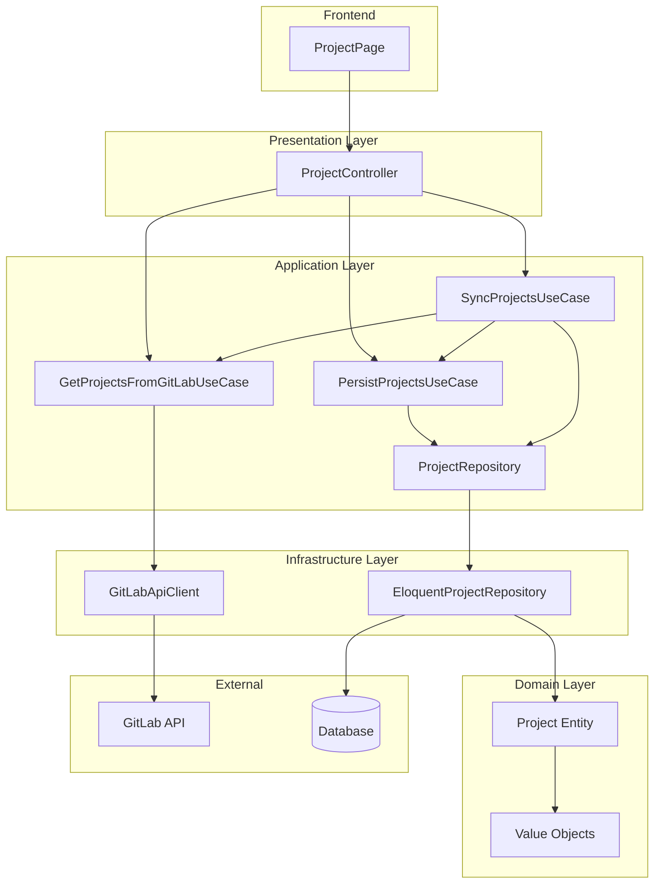
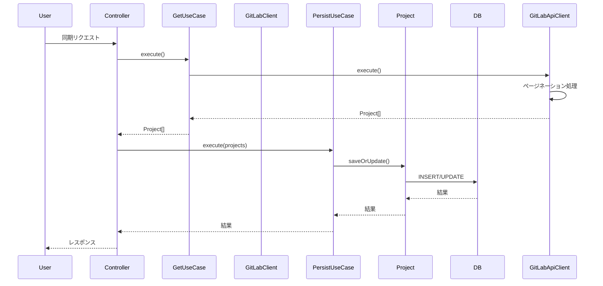

# Design Document

## Overview

本機能は、GitLab APIからプロジェクト一覧を取得し、データベースに永続化する機能を提供します。システム管理者はGitLabのプロジェクト情報をアプリケーション内で管理・表示でき、手動で同期を実行して最新の情報を維持できます。

**Users**: システム管理者がプロジェクト情報の取得と同期を実行し、ユーザーがプロジェクト一覧を閲覧します。

**Impact**: クリーンアーキテクチャの層構造を新規作成し、外部API統合のパターンを確立します。これにより、プロジェクトのアーキテクチャパターンの基盤が構築されます。

### Goals
- GitLab APIからプロジェクト一覧を取得し、データベースに永続化する
- クリーンアーキテクチャの原則に従った実装パターンを確立する
- 手動同期機能により、ユーザーが最新のプロジェクト情報を取得できる
- プロジェクト一覧をフロントエンドで表示する

### Non-Goals
- 自動同期機能（バッチジョブやスケジューラー）
- プロジェクトの詳細情報の取得（コミット、ブランチなど）
- プロジェクトの作成・更新・削除操作
- 複数のGitLabインスタンスへの対応

## Architecture

### Architecture Pattern & Boundary Map



**Architecture Integration**:
- Selected pattern: クリーンアーキテクチャ（4層構造）
- Domain/feature boundaries: プロジェクト管理機能を独立したドメインとして分離
- Existing patterns preserved: Inertia.jsによるフロントエンド統合、Laravel標準のHTTPクライアント
- New components rationale: 
  - ドメイン層: プロジェクトエンティティでビジネスロジックを表現
  - アプリケーション層: ユースケースインターフェースでビジネスロジックをオーケストレーション、GetProjectsFromGitLabUseCaseがインターフェースとして機能
  - インフラストラクチャ層: GetProjectsFromGitLabUseCaseインターフェースの実装（GitLabApiClient）とデータアクセス実装
  - プレゼンテーション層: HTTPリクエスト処理とInertia.jsレスポンス
- Steering compliance: クリーンアーキテクチャの原則、型安全性、リポジトリパターンに準拠

### Technology Stack

| Layer | Choice / Version | Role in Feature | Notes |
|-------|------------------|-----------------|-------|
| Backend | Laravel 12 | フレームワーク基盤 | 既存スタック |
| Backend | PHP 8.5 | ランタイム | 既存スタック（イミュータブルエンティティ対応） |
| Backend | Guzzle (Laravel HTTP Client) | GitLab API通信 | Laravel標準 |
| Frontend | React 19 | UIコンポーネント | 既存スタック |
| Frontend | TypeScript 5.7 | 型安全性 | 既存スタック |
| Frontend | Inertia.js 2.x | フロントエンド統合 | 既存スタック |
| Data | MySQL/PostgreSQL | データベース | 既存スタック |
| Data | Eloquent ORM | データアクセス | Laravel標準 |

## System Flows

### プロジェクト一覧取得と永続化フロー



**Key Decisions**:
- 同期処理は手動トリガーで実行（ユーザーがボタンをクリック）
- ページネーションはoffset-based方式を採用（全ページを取得）
- 既存プロジェクトは更新、新規プロジェクトは作成

## Requirements Traceability

| Requirement | Summary | Components | Interfaces | Flows |
|-------------|---------|------------|------------|-------|
| 1.1 | 認証済みリクエスト送信 | GitLabApiClient | GetProjectsFromGitLabUseCase | プロジェクト取得フロー |
| 1.2 | プロジェクト情報のパース | GitLabApiClient, GetProjectsFromGitLabUseCase | GetProjectsFromGitLabUseCase | プロジェクト取得フロー |
| 1.3 | 認証エラー処理 | GitLabApiClient | GetProjectsFromGitLabUseCase | エラーハンドリング |
| 1.4 | タイムアウトエラー処理 | GitLabApiClient | GetProjectsFromGitLabUseCase | エラーハンドリング |
| 1.5 | エラーレスポンス処理 | GitLabApiClient | GetProjectsFromGitLabUseCase | エラーハンドリング |
| 1.6 | 全ページ取得と統合 | GitLabApiClient | GetProjectsFromGitLabUseCase | プロジェクト取得フロー |
| 2.1 | データベース保存 | PersistProjectsUseCase, EloquentProjectRepository | ProjectRepository | 永続化フロー |
| 2.2 | 既存情報の更新 | PersistProjectsUseCase, EloquentProjectRepository | ProjectRepository | 永続化フロー |
| 2.3 | 保存エラー処理 | PersistProjectsUseCase, EloquentProjectRepository | - | エラーハンドリング |
| 2.4 | 必須フィールド検証 | Project Entity | - | 永続化フロー |
| 2.5 | トランザクション保証 | PersistProjectsUseCase | - | 永続化フロー |
| 3.1 | 一覧表示 | ProjectController, ProjectPage | - | 表示フロー |
| 3.2 | 空状態表示 | ProjectPage | - | 表示フロー |
| 3.3 | エラー表示 | ProjectPage | - | エラーハンドリング |
| 3.4 | ローディング表示 | ProjectPage | - | 表示フロー |
| 4.1 | 同期リクエスト処理 | ProjectController, SyncProjectsUseCase | - | 同期フロー |
| 4.2 | データベース更新 | SyncProjectsUseCase, PersistProjectsUseCase | - | 同期フロー |
| 4.3 | 削除プロジェクト検出 | SyncProjectsUseCase | - | 同期フロー |
| 4.4 | 部分更新とエラー記録 | SyncProjectsUseCase | - | エラーハンドリング |

## Components and Interfaces

| Component | Domain/Layer | Intent | Req Coverage | Key Dependencies (P0/P1) | Contracts |
|-----------|--------------|--------|--------------|--------------------------|-----------|
| Project | Domain | プロジェクトエンティティ（イミュータブル） | 2.4 | Value Objects (P0) | - |
| GetProjectsFromGitLabUseCase | Application | GitLab APIからプロジェクト取得インターフェース | 1.1, 1.2, 1.6 | - | Service |
| PersistProjectsUseCase | Application | プロジェクト永続化 | 2.1, 2.2, 2.4, 2.5 | ProjectRepository (P0) | Service |
| SyncProjectsUseCase | Application | プロジェクト同期 | 4.1, 4.2, 4.3, 4.4 | GetProjectsFromGitLabUseCase (P0), PersistProjectsUseCase (P0), ProjectRepository (P0) | Service |
| ProjectRepository | Application | プロジェクトデータアクセスインターフェース | 2.1, 2.2 | - | Service |
| GitLabApiClient | Infrastructure | GetProjectsFromGitLabUseCase実装 | 1.1, 1.2, 1.3, 1.4, 1.5, 1.6 | Laravel HTTP Client (P0), GitLab API (External, P0), FetchesProjects (P0) | Service |
| FetchesProjects | Infrastructure | プロジェクト取得機能のトレイト | 1.1, 1.2, 1.6 | Laravel HTTP Client (P0), GitLab API (External, P0) | Trait |
| EloquentProjectRepository | Infrastructure | プロジェクトデータアクセス実装 | 2.1, 2.2, 2.3 | Eloquent ORM (P0), Project Entity (P0) | Service |
| ProjectController | Presentation | HTTPリクエスト処理 | 3.1, 4.1 | GetProjectsFromGitLabUseCase (P0), PersistProjectsUseCase (P0), SyncProjectsUseCase (P0) | API |
| ProjectPage | Frontend | プロジェクト一覧表示 | 3.1, 3.2, 3.3, 3.4, 4.1 | Inertia.js (P0) | - |

### Domain Layer

#### Project Entity

| Field | Detail |
|-------|--------|
| Intent | GitLabプロジェクトを表現するイミュータブルなドメインエンティティ |
| Requirements | 2.4 |

**Responsibilities & Constraints**
- プロジェクトのビジネスロジックと不変条件を定義
- 必須フィールドの検証（プロジェクトID、名前空間付きプロジェクト名）
- ドメイン層はフレームワーク非依存
- PHP 8.5のreadonlyプロパティを使用してイミュータブルに実装

**Dependencies**
- Inbound: なし
- Outbound: Value Objects（ProjectId, ProjectDescription, ProjectNameWithNamespace, DefaultBranch） (P0)
- External: なし

**Contracts**: State [✓]

##### State Management
- State model: プロジェクトの属性（すべてバリューオブジェクトとして表現）
- Persistence & consistency: データベースに永続化、プロジェクトIDによる一意性保証
- Concurrency strategy: トランザクションによる整合性保証（楽観的ロックは不要）

**Implementation Notes**
- Validation: 必須フィールドの検証をバリューオブジェクト内で実装
- Immutability: すべてのプロパティをreadonlyとして定義し、コンストラクタでのみ設定可能
- Value Objects: すべてのプロパティはバリューオブジェクトクラスとして実装
- Risks: フレームワーク依存のコードをドメイン層に含めない

#### Value Objects

| Field | Detail |
|-------|--------|
| Intent | Projectエンティティのプロパティを表現するバリューオブジェクト |
| Requirements | 2.4 |

**Value Object Classes**:
- `ProjectId`: プロジェクトID（整数値）
- `ProjectDescription`: プロジェクト説明（文字列、nullable）
- `ProjectNameWithNamespace`: 名前空間付きプロジェクト名（文字列、空文字列不可）
- `DefaultBranch`: デフォルトブランチ名（文字列、nullable）

**Responsibilities & Constraints**
- 各バリューオブジェクトは不変（イミュータブル）
- 値の検証をコンストラクタで実行
- 等価性の比較を実装

**Implementation Notes**
- Validation: 各バリューオブジェクトで適切な検証を実装（例: URL形式、空文字列チェック）
- Immutability: readonlyプロパティを使用
- Risks: なし

### Application Layer

#### GetProjectsFromGitLabUseCase

| Field | Detail |
|-------|--------|
| Intent | GitLab APIからプロジェクト一覧を取得するインターフェース（アプリケーション層） |
| Requirements | 1.1, 1.2, 1.6 |

**Responsibilities & Constraints**
- GitLab APIから全ページのプロジェクトを取得するインターフェースを定義
- アプリケーション層とインフラストラクチャ層の境界を定義
- Projectエンティティを返却

**Dependencies**
- Inbound: ProjectController, SyncProjectsUseCase — インターフェース使用 (P0)
- Outbound: なし
- External: なし

**Contracts**: Service [✓]

##### Service Interface
```php
interface GetProjectsFromGitLabUseCase
{
    /**
     * GitLab APIから全プロジェクトを取得
     * 
     * @return array<Project>
     * @throws GitLabApiException
     */
    public function execute(): array;
}
```
- Preconditions: GitLab API設定と認証トークンが有効
- Postconditions: 全ページのプロジェクトが取得され、Projectエンティティの配列として返却
- Invariants: 返却されるプロジェクトは重複なし

**Implementation Notes**
- Integration: インフラストラクチャ層でGitLabApiClient実装を提供
- Validation: APIレスポンスの検証とエラーハンドリングは実装側で実行
- Risks: なし

#### PersistProjectsUseCase

| Field | Detail |
|-------|--------|
| Intent | プロジェクト情報をデータベースに永続化するユースケース |
| Requirements | 2.1, 2.2, 2.4, 2.5 |

**Responsibilities & Constraints**
- プロジェクト情報をデータベースに保存
- 既存プロジェクトは更新、新規プロジェクトは作成
- トランザクション内で処理を実行

**Dependencies**
- Inbound: ProjectController, SyncProjectsUseCase — ユースケース呼び出し (P0)
- Outbound: ProjectRepository — データアクセス (P0)
- External: なし

**Contracts**: Service [✓]

##### Service Interface
```php
interface PersistProjectsUseCase
{
    /**
     * プロジェクト情報を永続化
     * 
     * @param array<Project> $projects
     * @return void
     * @throws PersistenceException
     */
    public function execute(array $projects): void;
}
```
- Preconditions: プロジェクトエンティティが有効（必須フィールドが設定済み）
- Postconditions: 全プロジェクトがデータベースに保存または更新される
- Invariants: トランザクション内で実行され、すべて成功するかすべてロールバック

**Implementation Notes**
- Integration: ProjectRepositoryを使用してデータアクセス
- Validation: エンティティの必須フィールド検証を実行
- Risks: 大量データ処理時のトランザクションタイムアウト

#### SyncProjectsUseCase

| Field | Detail |
|-------|--------|
| Intent | プロジェクト情報をGitLab APIから取得して同期するユースケース |
| Requirements | 4.1, 4.2, 4.3, 4.4 |

**Responsibilities & Constraints**
- GitLab APIから最新のプロジェクト一覧を取得
- データベースのプロジェクト情報を更新
- 削除されたプロジェクトを検出して処理
- エラー時は部分的な更新を許可

**Dependencies**
- Inbound: ProjectController — ユースケース呼び出し (P0)
- Outbound: GetProjectsFromGitLabUseCase — プロジェクト取得 (P0), PersistProjectsUseCase — 永続化 (P0), ProjectRepository — データアクセス (P0)
- External: なし

**Contracts**: Service [✓]

##### Service Interface
```php
interface SyncProjectsUseCase
{
    /**
     * プロジェクト情報を同期
     * 
     * @return SyncResult
     * @throws SyncException
     */
    public function execute(): SyncResult;
}
```
- Preconditions: GitLab API設定が有効
- Postconditions: 最新のプロジェクト情報がデータベースに反映される
- Invariants: 削除されたプロジェクトは`deleted_at`カラムにタイムスタンプを設定（ソフトデリート）

**Implementation Notes**
- Integration: GetProjectsFromGitLabUseCaseとPersistProjectsUseCaseを組み合わせて実行
- Validation: 同期結果の検証とエラーログ記録
- Risks: 同期処理の長時間実行、部分的な更新失敗時の整合性

#### ProjectRepository

| Field | Detail |
|-------|--------|
| Intent | プロジェクトデータアクセスのインターフェース |
| Requirements | 2.1, 2.2 |

**Responsibilities & Constraints**
- プロジェクトのデータアクセス操作を定義
- アプリケーション層とインフラストラクチャ層の境界を定義

**Dependencies**
- Inbound: PersistProjectsUseCase, SyncProjectsUseCase — インターフェース使用 (P0)
- Outbound: なし
- External: なし

**Contracts**: Service [✓]

##### Service Interface
```php
interface ProjectRepository
{
    /**
     * 全プロジェクトを取得
     * 
     * @return array<Project>
     */
    public function findAll(): array;
    
    /**
     * プロジェクトIDでプロジェクトを取得
     * 
     * @param ProjectId $projectId
     * @return Project|null
     */
    public function findByProjectId(ProjectId $projectId): ?Project;
    
    /**
     * プロジェクトを保存または更新
     * 
     * @param Project $project
     * @return Project
     */
    public function save(Project $project): Project;
    
    /**
     * 複数のプロジェクトを一括保存または更新
     * 
     * @param array<Project> $projects
     * @return void
     */
    public function saveMany(array $projects): void;
    
    /**
     * プロジェクトを削除
     * 
     * @param Project $project
     * @return void
     */
    public function delete(Project $project): void;
    
    /**
     * プロジェクトIDのリストに存在しないプロジェクトを取得
     * 
     * @param array<ProjectId> $projectIds
     * @return array<Project>
     */
    public function findNotInProjectIds(array $projectIds): array;
}
```
- Preconditions: プロジェクトエンティティが有効
- Postconditions: データベース操作が正常に完了
- Invariants: トランザクション内で実行される操作は整合性を保証

**Implementation Notes**
- Integration: インフラストラクチャ層でEloquent実装を提供
- Validation: エンティティの検証はドメイン層で実行
- Risks: なし

### Infrastructure Layer

#### FetchesProjects

| Field | Detail |
|-------|--------|
| Intent | プロジェクト取得機能を提供するトレイト（インフラストラクチャ層） |
| Requirements | 1.1, 1.2, 1.6 |

**Responsibilities & Constraints**
- GitLab APIからプロジェクト一覧を取得する機能を提供
- ページネーション処理
- APIレスポンスをProjectエンティティに変換
- エラーハンドリングとリトライ
- 将来の拡張性を考慮した設計（コメント取得など他の機能と分離）

**Dependencies**
- Inbound: GitLabApiClient — トレイト使用 (P0)
- Outbound: Laravel HTTP Client — HTTP通信 (P0)
- External: GitLab API — 外部サービス (P0)

**Contracts**: Trait [✓]

**Implementation Notes**
- Integration: Laravel HTTP Clientを使用、`PRIVATE-TOKEN`ヘッダーで認証
- API Endpoint: `GET /api/v4/projects`（プロジェクト一覧を取得）
- API Reference: [GitLab Projects API documentation](https://docs.gitlab.com/api/projects/) を参照
- Validation: APIレスポンスの検証、429エラー時の指数バックオフ
- Entity Conversion: APIレスポンスをProjectエンティティとバリューオブジェクトに変換
- Trait Design: 将来の機能追加（コメント取得など）を考慮し、機能ごとにトレイトを分離
- Risks: レート制限、タイムアウト、ネットワークエラー

#### GitLabApiClient

| Field | Detail |
|-------|--------|
| Intent | GetProjectsFromGitLabUseCaseインターフェースの実装（インフラストラクチャ層） |
| Requirements | 1.1, 1.2, 1.3, 1.4, 1.5, 1.6 |

**Responsibilities & Constraints**
- GetProjectsFromGitLabUseCaseインターフェースの実装
- GitLab APIへのHTTPリクエスト送信の基盤機能を提供
- 認証トークンの管理
- 共通のエラーハンドリング
- 機能別のトレイト（FetchesProjectsなど）をmixinして機能を拡張

**Dependencies**
- Inbound: ProjectController, SyncProjectsUseCase — GetProjectsFromGitLabUseCaseインターフェース経由で呼び出し (P0)
- Outbound: Laravel HTTP Client — HTTP通信 (P0), FetchesProjects — プロジェクト取得機能 (P0)
- External: GitLab API — 外部サービス (P0)

**Contracts**: Service [✓]

**Implementation Notes**
- Integration: Laravel HTTP Clientを使用、`PRIVATE-TOKEN`ヘッダーで認証
- Trait Usage: `FetchesProjects`トレイトを使用してプロジェクト取得機能を実装
- Future Extensibility: 将来の機能追加（コメント取得など）は別のトレイトとして実装し、mixinする設計
- Interface Implementation: GetProjectsFromGitLabUseCaseインターフェースを実装
- Risks: レート制限、タイムアウト、ネットワークエラー

#### EloquentProjectRepository

| Field | Detail |
|-------|--------|
| Intent | プロジェクトリポジトリのEloquent実装 |
| Requirements | 2.1, 2.2, 2.3 |

**Responsibilities & Constraints**
- ProjectRepositoryインターフェースのEloquent実装
- データベースへのアクセス
- ProjectエンティティとEloquentモデルの変換
- バリューオブジェクトとデータベースカラムの変換

**Dependencies**
- Inbound: PersistProjectsUseCase, SyncProjectsUseCase — ProjectRepositoryインターフェース経由で呼び出し (P0)
- Outbound: Eloquent ORM — データアクセス (P0), Project Entity — エンティティ変換 (P0)
- External: データベース — データ永続化 (P0)

**Contracts**: Service [✓]

**Implementation Notes**
- Integration: Eloquentモデルを使用してデータアクセス、エンティティとバリューオブジェクトとの変換を実装
- Validation: データベース制約による検証
- Value Object Conversion: バリューオブジェクトとプリミティブ型の相互変換を実装
- Risks: 大量データ処理時のパフォーマンス

### Presentation Layer

#### ProjectController

| Field | Detail |
|-------|--------|
| Intent | プロジェクト関連のHTTPリクエストを処理するコントローラー |
| Requirements | 3.1, 4.1 |

**Responsibilities & Constraints**
- HTTPリクエストの処理
- ユースケースの呼び出し
- Inertia.jsレスポンスの生成
- ビジネスロジックは含まない

**Dependencies**
- Inbound: HTTPリクエスト — ルーティング (P0)
- Outbound: GetProjectsFromGitLabUseCase — プロジェクト取得 (P0), PersistProjectsUseCase — 永続化 (P0), SyncProjectsUseCase — 同期 (P0), ProjectRepository — データアクセス (P0)
- External: Inertia.js — フロントエンド統合 (P0)

**Contracts**: API [✓]

##### API Contract
| Method | Endpoint | Request | Response | Errors |
|--------|----------|---------|----------|--------|
| GET | /projects | - | Inertia Page (projects) | 500 |
| POST | /projects/sync | - | Redirect /projects | 500, 429 |

**Implementation Notes**
- Location: `/app/Presentation/Controller/ProjectController.php`
- Integration: Inertia.jsを使用してフロントエンドにデータを渡す
- Validation: HTTPリクエストの検証はミドルウェアで実行
- Request/Response: リクエストとレスポンスの変換は責務ごとにディレクトリを分け、その下で機能ごとに整理
  - 構成: `/app/Presentation/Request/Project/ListRequest.php`, `/app/Presentation/Response/Project/ListResponse.php`
  - 理由: 責務（Controller/Request/Response）ごとにディレクトリを分け、その下で機能（Project）ごとに整理することで、構造の一貫性とスケーラビリティを確保。将来的な拡張（例：`SyncRequest`、`SyncResponse`、他の機能の追加）に対応しやすい
- Risks: エラーハンドリングの一貫性

### Frontend

#### ProjectPage

| Field | Detail |
|-------|--------|
| Intent | プロジェクト一覧を表示するInertia.jsページコンポーネント |
| Requirements | 3.1, 3.2, 3.3, 3.4, 4.1 |

**Responsibilities & Constraints**
- プロジェクト一覧の表示
- 同期ボタンの提供
- ローディング、エラー、空状態の表示

**Dependencies**
- Inbound: Inertia.js — データ受け取り (P0)
- Outbound: Inertia.js — 同期リクエスト送信 (P0)
- External: なし

**Implementation Notes**
- Integration: Inertia.jsの`useForm`を使用して同期リクエストを送信
- Validation: フロントエンドでのバリデーションは最小限
- Risks: 同期処理中のUI状態管理

## Data Models

### Domain Model

**Aggregates and Transactional Boundaries**:
- `Project`が集約ルート
- プロジェクトの作成・更新は単一トランザクション内で実行

**Entities, Value Objects, Domain Events**:
- `Project`エンティティ: プロジェクトの属性とビジネスロジック（イミュータブル）
- バリューオブジェクト: `ProjectId`, `ProjectDescription`, `ProjectNameWithNamespace`, `DefaultBranch`

**Business Rules & Invariants**:
- プロジェクトIDは一意
- 必須フィールド: `id`（プロジェクトID）, `name_with_namespace`
- 名前空間付きプロジェクト名は空文字列不可
- エンティティはイミュータブル（readonlyプロパティ）

### Logical Data Model

**Structure Definition**:
- `projects`テーブル: プロジェクト情報を格納
- 主キー: `id`（GitLab APIのプロジェクトID）
- 属性: `id`, `description`, `name_with_namespace`, `default_branch`, `deleted_at`（ソフトデリート用）

**Consistency & Integrity**:
- トランザクション境界: プロジェクトの一括保存は単一トランザクション
- カスケード規則: なし

### Physical Data Model

**Table Definition**:
```sql
CREATE TABLE projects (
    id BIGINT UNSIGNED NOT NULL PRIMARY KEY,
    description TEXT,
    name_with_namespace VARCHAR(500) NOT NULL,
    default_branch VARCHAR(255),
    deleted_at TIMESTAMP NULL
) ENGINE=InnoDB DEFAULT CHARSET=utf8mb4 COLLATE=utf8mb4_unicode_ci;
```

**Indexes**:
- `id`: プライマリキーとして自動的にインデックス化される（GitLab APIのプロジェクトID）
- `deleted_at`: ソフトデリートされたレコードの検索を最適化（NULL値のインデックス）

### Data Contracts & Integration

**API Data Transfer**:
- Request: 同期リクエストはパラメータなし
- Response: プロジェクト一覧はInertia.js経由でフロントエンドに渡される
- Validation: エンティティレベルで必須フィールドを検証

## Error Handling

### Error Strategy

**Error Categories**:
- **User Errors (4xx)**: 認証エラー（401）、バリデーションエラー（422）
- **System Errors (5xx)**: GitLab APIエラー、データベースエラー、タイムアウト
- **Business Logic Errors (422)**: プロジェクト情報の検証エラー

**Recovery Mechanisms**:
- GitLab APIレート制限（429）: 指数バックオフとリトライ
- タイムアウト: タイムアウト時間の設定とエラーメッセージ表示
- データベースエラー: トランザクションロールバックとエラーログ記録

### Error Categories and Responses

**User Errors (4xx)**:
- 認証エラー（401）: "GitLab API認証に失敗しました。設定を確認してください。"
- バリデーションエラー（422）: フィールドレベルのエラーメッセージ

**System Errors (5xx)**:
- GitLab APIエラー: "GitLab APIへの接続に失敗しました。しばらくしてから再度お試しください。"
- タイムアウト: "リクエストがタイムアウトしました。データ量が多い場合は時間がかかる場合があります。"
- データベースエラー: "データの保存に失敗しました。管理者にお問い合わせください。"

**Business Logic Errors (422)**:
- プロジェクト情報の検証エラー: "プロジェクト情報が不正です。必須フィールドを確認してください。"

### Monitoring

- エラーログ: Laravel標準のログ機能を使用
- 監視: GitLab API呼び出しの成功率、レスポンス時間、エラー率を監視
- アラート: 連続したエラー発生時にアラート

## Testing Strategy

### Unit Tests
- `Project`エンティティの必須フィールド検証とイミュータビリティ
- バリューオブジェクトの検証ロジック
- `FetchesProjects`トレイトのページネーション処理とエンティティ変換
- `GitLabApiClient`のトレイト統合とインターフェース実装
- `GetProjectsFromGitLabUseCase`のプロジェクト取得ロジック
- `PersistProjectsUseCase`の保存・更新ロジック
- `SyncProjectsUseCase`の同期ロジック

### Integration Tests
- GitLab API統合テスト（モック使用）
- データベース統合テスト（プロジェクトの保存・更新・削除）
- 同期フローの統合テスト

### E2E/UI Tests
- プロジェクト一覧表示のテスト
- 同期ボタンクリックのテスト
- ローディング状態のテスト
- エラー状態のテスト

### Performance/Load
- 大量プロジェクト（1000件以上）の同期処理
- ページネーション処理のパフォーマンス
- データベースクエリの最適化

## Security Considerations

- **認証トークン管理**: GitLab APIトークンは環境変数（`.env`）で管理し、バージョン管理に含めない
- **入力検証**: APIレスポンスの検証とサニタイゼーション
- **エラーメッセージ**: 機密情報（トークン、内部エラー詳細）をエラーメッセージに含めない
- **レート制限**: GitLab APIのレート制限を遵守し、適切なリトライ戦略を実装

## Performance & Scalability

- **ページネーション**: offset-based方式を採用し、将来的にkeyset-basedへの移行を検討
- **データベースインデックス**: `id`（プライマリキー）として自動的にインデックス化される
- **バッチ処理**: 大量プロジェクトの一括保存はチャンク処理を検討
- **キャッシュ**: プロジェクト一覧の表示は必要に応じてキャッシュを検討（現時点では未実装）
