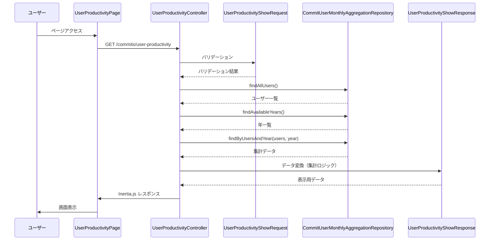
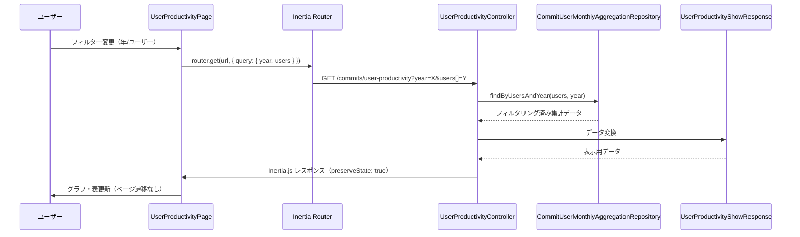

# Technical Design Document

## Overview
本機能は、GitLabのコミットデータをユーザー単位で月次集計し、複数リポジトリにまたがる生産性を可視化する「ユーザー生産性」機能を提供します。既存の`CommitUserMonthlyAggregation`テーブルのデータを使用し、1ユーザーに対して複数リポジトリのコミットを集計して表示します。既存の「集計」機能と同様に、グラフと表でデータを可視化しますが、集計単位がプロジェクト・ブランチ単位からユーザー単位に変更されます。

**Purpose**: この機能は、複数リポジトリにまたがるユーザーの生産性を横断的に分析するための可視化を提供します。

**Users**: プロジェクト管理者やチームリーダーが、ユーザーごとの月次生産性を確認し、複数リポジトリにまたがる活動を統合的に把握するために利用します。

**Impact**: 既存の「集計」機能（プロジェクト・ブランチ単位）に加えて、ユーザー単位での集計機能を追加します。既存のデータモデルとリポジトリを拡張し、新規のプレゼンテーション層コンポーネントとフロントエンドページを追加します。既存の`Commit`エンティティと`CommitUserMonthlyAggregation`エンティティは変更しません（影響範囲を最小化するため）。

### Goals
- 複数リポジトリにまたがる同一ユーザーのコミットデータを月次で統合表示
- 年フィルターとユーザー複数選択フィルターによる柔軟なデータ分析
- 既存の「集計」機能と同様のUI/UXを提供し、一貫性のあるユーザー体験を実現
- 既存のアーキテクチャパターンに従い、保守性とテスタビリティを確保

### Non-Goals
- 新規テーブルの作成（既存の`CommitUserMonthlyAggregation`テーブルを使用）
- リアルタイムデータ更新（既存の集計データを使用）
- ユーザー認証・認可機能（既存の認証システムを使用）
- データエクスポート機能（将来の拡張として検討可能）

## Architecture

### Existing Architecture Analysis
既存の「集計」機能（`CommitController::aggregationShow`）は、プロジェクト・ブランチ単位でデータを取得・表示します。本機能は既存のアーキテクチャパターンを踏襲しつつ、以下の点で拡張します：

- **リポジトリ層**: `CommitUserMonthlyAggregationRepository`インターフェースに新規メソッドを追加（プロジェクト・ブランチを指定しないデータ取得）
- **プレゼンテーション層**: 新規コントローラー`UserProductivityController`を作成（既存の`CommitController`とは別）
- **フロントエンド**: 新規ページコンポーネント`Commit/UserProductivity.tsx`を作成（既存の`Commit/Aggregation.tsx`を参考）

既存のクリーンアーキテクチャの原則（プレゼンテーション層 → アプリケーション層 → ドメイン層 → インフラストラクチャ層）を維持し、依存関係の方向を制御します。

### Architecture Pattern & Boundary Map

```mermaid
graph TB
    subgraph "Presentation Layer"
        UserProductivityController[UserProductivityController]
        UserProductivityShowRequest[UserProductivityShowRequest]
        UserProductivityShowResponse[UserProductivityShowResponse]
    end
    
    subgraph "Infrastructure Layer"
        EloquentCommitUserMonthlyAggregationRepository[EloquentCommitUserMonthlyAggregationRepository]
    end
    
    subgraph "Application Layer"
        CommitUserMonthlyAggregationRepository[CommitUserMonthlyAggregationRepository Port]
    end
    
    subgraph "Domain Layer"
        CommitUserMonthlyAggregation[CommitUserMonthlyAggregation Entity]
        UserInfo[UserInfo Entity]
    end
    
    subgraph "Frontend"
        UserProductivityPage[Commit/UserProductivity.tsx]
        CheckboxComponent[Checkbox UI Component]
    end
    
    UserProductivityController --> UserProductivityShowRequest
    UserProductivityController --> UserProductivityShowResponse
    UserProductivityController --> CommitUserMonthlyAggregationRepository
    CommitUserMonthlyAggregationRepository --> EloquentCommitUserMonthlyAggregationRepository
    EloquentCommitUserMonthlyAggregationRepository --> CommitUserMonthlyAggregation
    EloquentCommitUserMonthlyAggregationRepository --> UserInfo
    UserProductivityPage --> CheckboxComponent
    UserProductivityController -.Inertia.js.-> UserProductivityPage
```

**Architecture Integration**:
- **Selected pattern**: クリーンアーキテクチャ + Hexagonal Architecture（Ports and Adapters）
- **Domain/feature boundaries**: ユーザー生産性機能は既存の集計機能とは独立したコントローラーとページコンポーネントとして実装
- **Existing patterns preserved**: リポジトリパターン、Request/Response DTOパターン、Inertia.jsページコンポーネントパターン
- **New components rationale**: 
  - `UserProductivityController`: 既存の`CommitController`とは異なる責任を持つため分離
  - `UserProductivityShowRequest`: 年とユーザー配列のバリデーションを担当
  - `UserProductivityShowResponse`: ユーザー単位での集計データ変換を担当
  - `Checkbox` UIコンポーネント: ユーザー複数選択のための新規UIコンポーネント
- **Steering compliance**: クリーンアーキテクチャの原則、Ports and Adaptersパターン、TypeScript厳格モード、shadcn/uiベースのUIコンポーネント

### Technology Stack & Alignment

| Layer | Choice / Version | Role in Feature | Notes |
|-------|------------------|-----------------|-------|
| Frontend | React 19 | ページコンポーネントとUIコンポーネント | 既存のReact 19を使用 |
| Frontend | TypeScript 5.7 | 型安全性の確保 | 厳格モード、`any`型の使用禁止 |
| Frontend | shadcn/ui Checkbox | チェックボックスUIコンポーネント | shadcn/ui CLIで追加（既存のcomponents.json設定を使用） |
| Frontend | Recharts 3.6.0 | グラフ表示 | 既存のライブラリを再利用 |
| Frontend | Inertia.js 2.x | サーバーとクライアントの統合 | 既存のInertia.jsを使用 |
| Frontend | Tailwind CSS 4 | スタイリング | 既存のTailwind CSSを使用 |
| Backend | Laravel 12 | フレームワーク | 既存のLaravel 12を使用 |
| Backend | PHP 8.5.1 | ランタイム | 既存のPHPバージョンを使用 |
| Data | MySQL (via Eloquent) | データ永続化 | 既存の`CommitUserMonthlyAggregation`テーブルを使用 |

## System Flows

### ユーザー生産性画面表示フロー



### フィルター変更フロー



## Requirements Traceability

| Requirement | Summary | Components | Interfaces | Flows |
|-------------|---------|------------|------------|-------|
| 1.1 | 全ユーザーの月次集計データ取得 | UserProductivityController, CommitUserMonthlyAggregationRepository | findByUsersAndYear() | ユーザー生産性画面表示フロー |
| 1.2 | 年フィルターによるデータ取得 | UserProductivityController, UserProductivityShowRequest | findByUsersAndYear($authorEmails, $year) | フィルター変更フロー |
| 1.3 | ユーザーフィルターによるデータ取得 | UserProductivityController, UserProductivityShowRequest | findByUsersAndYear($authorEmails, $year) | フィルター変更フロー |
| 1.4 | 複数リポジトリのデータ統合 | UserProductivityShowResponse | buildChartData(), buildTableData() | ユーザー生産性画面表示フロー |
| 2.1 | 同一ユーザーのデータを月ごとに統合 | UserProductivityShowResponse | buildChartData(), buildTableData() | ユーザー生産性画面表示フロー |
| 2.2 | total_additionsの合計 | UserProductivityShowResponse | buildChartData(), buildTableData() | ユーザー生産性画面表示フロー |
| 2.3 | total_deletionsの合計 | UserProductivityShowResponse | buildChartData(), buildTableData() | ユーザー生産性画面表示フロー |
| 2.4 | commit_countの合計 | UserProductivityShowResponse | buildChartData(), buildTableData() | ユーザー生産性画面表示フロー |
| 2.5 | 空コレクションの返却 | UserProductivityShowResponse | toArray() | ユーザー生産性画面表示フロー |
| 3.1-3.6 | グラフ表示機能 | UserProductivityPage, Recharts | - | ユーザー生産性画面表示フロー |
| 4.1-4.6 | 表表示機能 | UserProductivityPage, Table UI | - | ユーザー生産性画面表示フロー |
| 5.1-5.7 | フィルタリング機能 | UserProductivityPage, UserProductivityController | router.get(), findByUsersAndYear() | フィルター変更フロー |
| 6.1-6.3 | 年一覧の取得 | UserProductivityController, CommitUserMonthlyAggregationRepository | findAvailableYears() | ユーザー生産性画面表示フロー |
| 7.1-7.7 | ユーザー一覧の取得と選択機能 | UserProductivityPage, Checkbox, CommitUserMonthlyAggregationRepository | findAllUsers(), Checkbox component | ユーザー生産性画面表示フロー、フィルター変更フロー |
| 8.1-8.3 | データ永続化の利用 | CommitUserMonthlyAggregationRepository | - | - |

## Components and Interfaces

| Component | Domain/Layer | Intent | Req Coverage | Key Dependencies (P0/P1) | Contracts |
|-----------|--------------|--------|--------------|--------------------------|-----------|
| UserProductivityController | Presentation | ユーザー生産性画面の表示 | 1.1-1.4, 5.1-5.7, 6.1-6.3, 7.1-7.3 | CommitUserMonthlyAggregationRepository (P0), UserProductivityShowRequest (P0), UserProductivityShowResponse (P0) | API |
| UserProductivityShowRequest | Presentation | 年とユーザー配列のバリデーション | 1.2, 1.3, 5.1, 5.2 | - | - |
| UserProductivityShowResponse | Presentation | ユーザー単位での集計データ変換 | 1.4, 2.1-2.5, 3.1-3.6, 4.1-4.6 | - | - |
| CommitUserMonthlyAggregationRepository | Application/Port | 集計データの永続化インターフェース | 1.1-1.4, 6.1-6.3, 7.1-7.3, 8.1-8.3 | - | Service |
| EloquentCommitUserMonthlyAggregationRepository | Infrastructure | 集計データの永続化実装 | 1.1-1.4, 6.1-6.3, 7.1-7.3, 8.1-8.3 | CommitUserMonthlyAggregation (P0), UserInfo (P0) | Service |
| UserInfo | Domain | ユーザー情報エンティティ | 7.1-7.3 | AuthorEmail (P0), AuthorName (P0) | - |
| UserProductivityPage | Frontend | ユーザー生産性画面の表示 | 3.1-3.6, 4.1-4.6, 5.1-5.7, 7.4-7.7 | Checkbox (P0), Recharts (P0), Inertia.js (P0) | State |
| Checkbox | Frontend | チェックボックスUIコンポーネント | 7.4-7.7 | shadcn/ui (P0), @radix-ui/react-checkbox (P1) | - |

### Presentation Layer

#### UserProductivityController

| Field | Detail |
|-------|--------|
| Intent | ユーザー生産性画面の表示を担当するコントローラー |
| Requirements | 1.1-1.4, 5.1-5.7, 6.1-6.3, 7.1-7.3 |
| Owner / Reviewers | - |

**Responsibilities & Constraints**
- HTTPリクエストの処理とInertia.jsレスポンスの生成
- リクエストバリデーション（`UserProductivityShowRequest`を使用）
- リポジトリからのデータ取得とレスポンス変換（`UserProductivityShowResponse`を使用）
- ビジネスロジックは含まない（既存の`CommitController`パターンに従う）

**Dependencies**
- Inbound: `CommitUserMonthlyAggregationRepository` — 集計データの取得 (P0)
- Inbound: `UserProductivityShowRequest` — リクエストバリデーション (P0)
- Inbound: `UserProductivityShowResponse` — レスポンスデータ変換 (P0)
- Outbound: Inertia.js — ページコンポーネントへのデータ渡し (P0)

**Contracts**: API [✓]

##### API Contract
| Method | Endpoint | Request | Response | Errors |
|--------|----------|---------|----------|--------|
| GET | /commits/user-productivity | Query: `year` (int, nullable), `users` (array<string>, nullable) | Inertia.js Response (UserProductivityPage) | 400 (バリデーションエラー), 500 (サーバーエラー) |

**Implementation Notes**
- 既存の`CommitController::aggregationShow`メソッドを参考に実装
- `BaseController::renderWithErrorHandling`を使用してエラーハンドリングを統一
- ルート名: `commits.user-productivity`

#### UserProductivityShowRequest

| Field | Detail |
|-------|--------|
| Intent | 年とユーザー配列のバリデーションを担当 |
| Requirements | 1.2, 1.3, 5.1, 5.2 |
| Owner / Reviewers | - |

**Responsibilities & Constraints**
- リクエストパラメータのバリデーションルール定義
- 年とユーザー配列の取得メソッド提供
- `BaseRequest`を継承（既存の`AggregationShowRequest`パターンに従う）

**Dependencies**
- Inbound: Laravel Request — HTTPリクエスト (P0)

**Contracts**: - 

**Implementation Notes**
- バリデーションルール: `year` (nullable, integer, min:1, max:9999), `users` (nullable, array), `users.*` (string, email)
- `getYear(): ?int`, `getUsers(): array<string>`メソッドを実装

#### UserProductivityShowResponse

| Field | Detail |
|-------|--------|
| Intent | ユーザー単位での集計データ変換を担当 |
| Requirements | 1.4, 2.1-2.5, 3.1-3.6, 4.1-4.6 |
| Owner / Reviewers | - |

**Responsibilities & Constraints**
- `CommitUserMonthlyAggregation`コレクションから表示用データへの変換
- 複数リポジトリにまたがる同一ユーザーのデータを統合（月ごとに`total_additions`、`total_deletions`、`commit_count`を合計）
- グラフ用データと表用データの構築
- 既存の`AggregationShowResponse`パターンに従うが、ユーザーキーは`author_email`のみを使用

**Dependencies**
- Inbound: `Collection<CommitUserMonthlyAggregation>` — 集計データ (P0)
- Inbound: `Collection<UserInfo>` — ユーザー一覧エンティティ (P0)
- Inbound: `Collection<int>` — 年一覧 (P0)

**Contracts**: - 

**Implementation Notes**
- `buildChartData()`: 月ごと、ユーザーごとにグループ化してグラフ用データを構築（既存の`AggregationShowResponse::buildChartData()`を参考）
- `buildTableData()`: 月ごとの合計行数（追加行数+削除行数）を表用データとして構築（既存の`AggregationShowResponse::buildTableData()`を参考）
- ユーザーキーは`author_email`のみを使用（既存は`project_id-branch_name-author_email`）
- `toArray()`: Inertia.jsに渡すための配列に変換

### Application Layer

#### CommitUserMonthlyAggregationRepository (Port)

| Field | Detail |
|-------|--------|
| Intent | 集計データの永続化を提供するポートインターフェース |
| Requirements | 1.1-1.4, 6.1-6.3, 7.1-7.3, 8.1-8.3 |
| Owner / Reviewers | - |

**Responsibilities & Constraints**
- データアクセスのインターフェース定義（Ports and Adaptersパターン）
- 既存のメソッドに加えて、新規メソッドを追加

**Dependencies**
- Outbound: `EloquentCommitUserMonthlyAggregationRepository` — 実装 (P0)

**Contracts**: Service [✓]

##### Service Interface
```php
interface CommitUserMonthlyAggregationRepository {
    // 既存メソッド（省略）
    
    /**
     * 利用可能なユーザー一覧を取得
     * 
     * @return Collection<int, UserInfo> ユーザー情報エンティティのコレクション
     */
    public function findAllUsers(): Collection;
    
    /**
     * 利用可能な年一覧を取得
     * 
     * @return Collection<int, int> 年のコレクション（昇順ソート済み）
     */
    public function findAvailableYears(): Collection;
    
    /**
     * ユーザー配列と年でフィルタリングして集計データを取得
     * プロジェクト・ブランチは指定しない（全リポジトリから取得）
     * 
     * @param array<string> $authorEmails ユーザーメールアドレスの配列。空配列`[]`の場合は全ユーザーを取得（フィルタリングなし）。nullは使用しない（常に配列として受け取る）
     * @param int|null $year 年。nullの場合は全年を取得（フィルタリングなし）
     * @return Collection<int, CommitUserMonthlyAggregation> 集計データのコレクション
     */
    public function findByUsersAndYear(array $authorEmails, ?int $year): Collection;
}
```

- Preconditions: `$authorEmails`は空配列`[]`（全ユーザー取得）または有効なメールアドレスの配列（nullは使用しない）、`$year`はnull（全年取得）または1-9999の整数
- Postconditions: 指定された条件に一致する集計データのコレクションを返却
- Invariants: 返却されるコレクションは`CommitUserMonthlyAggregation`エンティティのコレクション

### Domain Layer

#### UserInfo

| Field | Detail |
|-------|--------|
| Intent | ユーザー情報を表すドメインエンティティ |
| Requirements | 7.1-7.3 |
| Owner / Reviewers | - |

**Responsibilities & Constraints**
- ユーザー情報（`author_email`と`author_name`）を表現するエンティティ
- 既存の`AuthorEmail`と`AuthorName`のValue Objectsを使用
- 既存の`Project`エンティティと同様のパターンで実装（`readonly class`、`ComparesProperties`トレイト使用）

**Dependencies**
- Inbound: `AuthorEmail` — 値オブジェクト (P0)
- Inbound: `AuthorName` — 値オブジェクト (P0)

**Contracts**: - 

**Implementation Notes**
- `app/Domain/UserInfo.php`に配置
- `readonly class UserInfo`として定義
- `ComparesProperties`トレイトを使用（既存の`Project`エンティティと同様）
- コンストラクタ: `public function __construct(public AuthorEmail $email, public AuthorName $name) {}`
- 既存の`AuthorEmail`と`AuthorName`のValue Objectsをそのまま使用

### Infrastructure Layer

#### EloquentCommitUserMonthlyAggregationRepository

| Field | Detail |
|-------|--------|
| Intent | `CommitUserMonthlyAggregationRepository`インターフェースの実装 |
| Requirements | 1.1-1.4, 6.1-6.3, 7.1-7.3, 8.1-8.3 |
| Owner / Reviewers | - |

**Responsibilities & Constraints**
- Eloquentを使用したデータアクセス実装
- 既存のメソッドに加えて、新規メソッドを実装
- `ConvertsBetweenEntityAndModel`トレイトを使用してエンティティとEloquentモデルの変換

**Dependencies**
- Inbound: `CommitUserMonthlyAggregation` — ドメインエンティティ (P0)
- Inbound: `UserInfo` — ドメインエンティティ (P0)
- Outbound: `CommitUserMonthlyAggregationEloquentModel` — Eloquentモデル (P0)

**Contracts**: Service [✓]

**Implementation Notes**
- `findAllUsers()`: `SELECT DISTINCT author_email, author_name FROM commit_user_monthly_aggregations ORDER BY author_name`で取得し、`UserInfo`エンティティに変換して返却。`UserInfo`は`AuthorEmail`と`AuthorName`のValue Objectsを使用して構築
- `findAvailableYears()`: `SELECT DISTINCT year FROM commit_user_monthly_aggregations ORDER BY year`
- `findByUsersAndYear()`: `WHERE (author_email IN (...) OR empty array) AND (year = ? OR year IS NULL)`でクエリ構築
- プロジェクト・ブランチの条件は指定しない（全リポジトリから取得）

### Frontend

#### UserProductivityPage

| Field | Detail |
|-------|--------|
| Intent | ユーザー生産性画面のページコンポーネント |
| Requirements | 3.1-3.6, 4.1-4.6, 5.1-5.7, 7.4-7.7 |
| Owner / Reviewers | - |

**Responsibilities & Constraints**
- ユーザー生産性データの表示（グラフと表）
- 年フィルターとユーザー複数選択フィルターのUI
- フィルター変更時のページ更新（`preserveState: true`でページ遷移なし）
- 既存の`Commit/Aggregation.tsx`パターンに従う

**Dependencies**
- Inbound: Inertia.js — サーバーからのデータ受信 (P0)
- Inbound: Checkbox — ユーザー複数選択 (P0)
- Inbound: Recharts — グラフ表示 (P0)
- Inbound: Table UI — 表表示 (P0)
- Outbound: Inertia.js Router — フィルター変更時のページ更新 (P0)

**Contracts**: State [✓]

##### State Management
- State model: Inertia.jsのpropsから受け取るデータ（`years`, `users`, `selectedYear`, `selectedUsers`, `chartData`, `tableData`）
- Persistence & consistency: サーバー側でデータを取得・変換し、Inertia.jsでクライアントに渡す
- Concurrency strategy: フィルター変更時は`preserveState: true`でページ遷移なし、サーバーから最新データを取得

**Implementation Notes**
- 既存の`Commit/Aggregation.tsx`を参考に実装
- 年フィルターは`Select`コンポーネントを使用（既存パターン）
- ユーザー複数選択は`Checkbox`コンポーネントを使用（新規）
- フィルター変更時は`router.get(url, { query: { year, users }, preserveState: true, preserveScroll: true })`で更新
- 型定義は`resources/js/types/user.d.ts`に追加（`UserProductivityPageProps`インターフェースを定義）。既存の`AggregationPageProps`（`resources/js/types/commit.d.ts`）を参考に実装

#### Checkbox

| Field | Detail |
|-------|--------|
| Intent | チェックボックスUIプリミティブコンポーネント |
| Requirements | 7.4-7.7 |
| Owner / Reviewers | - |

**Responsibilities & Constraints**
- shadcn/uiのCheckboxコンポーネントを使用
- 既存のUIコンポーネントパターン（`select.tsx`, `button.tsx`）と一貫性を保つ
- Radix UIプリミティブ（`@radix-ui/react-checkbox`）をベースにしたスタイル済みコンポーネント

**Dependencies**
- Inbound: shadcn/ui — チェックボックスコンポーネント (P0)
- Inbound: `@radix-ui/react-checkbox` — チェックボックスプリミティブ（shadcn/uiが使用） (P1)
- Inbound: `lucide-react` — CheckIcon (P0)
- Inbound: `@/lib/utils` — `cn()`関数 (P0)

**Contracts**: - 

**Implementation Notes**
- shadcn/ui CLIを使用してコンポーネントを追加: `npx shadcn@latest add checkbox`
- `components.json`の設定に基づいて`resources/js/components/ui/checkbox.tsx`が作成される
- 既存のUIコンポーネント（`select.tsx`, `button.tsx`）と同じパターンで実装される
- プロジェクトのデザインシステム（Tailwind CSS、`cn()`関数）に自動統合される
- 必要に応じて、生成されたコンポーネントをカスタマイズ可能

## Data Models

### Domain Model
- **Aggregate**: `CommitUserMonthlyAggregation`（既存、変更不要）
  - エンティティ: `CommitUserMonthlyAggregation`
  - 値オブジェクト: `CommitUserMonthlyAggregationId`, `Additions`, `Deletions`, `CommitCount`, `AuthorName`, `AuthorEmail`, `AggregationYear`, `AggregationMonth`
  - ビジネスルール: 同一ユーザー（`author_email`）の複数リポジトリのデータを月ごとに統合する際は、`total_additions`、`total_deletions`、`commit_count`を合計する
- **Aggregate**: `Commit`（既存、変更不要）
  - エンティティ: `Commit`
  - 値オブジェクト: `CommitId`, `CommitMessage`, `CommittedDate`, `AuthorName`, `AuthorEmail`, `Additions`, `Deletions`
- **Entity**: `UserInfo`（新規作成）
  - エンティティ: `UserInfo`
  - 値オブジェクト: `AuthorEmail`, `AuthorName`
  - ビジネスルール: ユーザー情報を表すエンティティ。`author_email`と`author_name`を持つ。既存の`AuthorEmail`と`AuthorName`のValue Objectsを使用。既存の`Commit`や`CommitUserMonthlyAggregation`エンティティには影響しない（影響範囲を最小化するため）

### Logical Data Model
**Structure Definition**:
- 既存の`commit_user_monthly_aggregations`テーブルを使用（新規テーブル作成なし）
- テーブル構造: `project_id`, `branch_name`, `author_email`, `year`, `month`, `author_name`, `total_additions`, `total_deletions`, `commit_count`
- 新機能では`project_id`と`branch_name`を無視して、`author_email`、`year`、`month`でグループ化

**Consistency & Integrity**:
- トランザクション境界: データ取得のみ（読み取り専用）
- 参照整合性: 既存のテーブル制約を維持

### Data Contracts & Integration

**API Data Transfer**
- Request schema: `{ year?: number, users?: string[] }`（クエリパラメータ）
- Response schema: Inertia.js props
  ```typescript
  {
    years: number[];
    users: Array<{ author_email: string; author_name: string | null }>;
    selectedYear?: number;
    selectedUsers?: string[];
    chartData: Array<{ month: string; [userName_additions]: number; [userName_deletions]: number }>;
    tableData: Array<{ userKey: string; userName: string; months: Record<number, number> }>;
    userNames: string[];
    error?: string;
    success?: string;
  }
  ```
- Validation rules: `year` (nullable, integer, min:1, max:9999), `users` (nullable, array), `users.*` (string, email)
- Serialization format: JSON（Inertia.jsが自動処理）

## Error Handling

### Error Strategy
既存の`CommitController`パターンに従い、`BaseController::renderWithErrorHandling`を使用してエラーハンドリングを統一します。

### Error Categories and Responses
**User Errors** (4xx): 
- バリデーションエラー（400）: リクエストパラメータが無効な場合、`abort(400, 'リクエストパラメータが無効です。')`を返却

**System Errors** (5xx):
- サーバーエラー（500）: データ取得失敗時、`renderWithErrorHandling`の第2引数で指定されたエラーメッセージを表示

**Business Logic Errors** (422):
- 該当なし（データが存在しない場合は空のコレクションを返却）

### Monitoring
既存のロギングシステムを使用。エラー発生時はLaravelのログに記録されます。

## Testing Strategy

### Unit Tests
- `UserProductivityShowResponse::buildChartData()`: 複数リポジトリにまたがる同一ユーザーのデータが正しく統合されることを検証
- `UserProductivityShowResponse::buildTableData()`: 月ごとの合計行数が正しく計算されることを検証
- `UserProductivityShowRequest::rules()`: バリデーションルールが正しく定義されていることを検証
- `EloquentCommitUserMonthlyAggregationRepository::findAllUsers()`: ユーザー一覧が正しく取得され、`UserInfo`エンティティに変換されることを検証
- `EloquentCommitUserMonthlyAggregationRepository::findByUsersAndYear()`: フィルタリングが正しく動作することを検証

### Integration Tests
- `UserProductivityController::show()`: コントローラーからレスポンスまでの統合フローを検証
- 複数リポジトリにまたがる同一ユーザーのデータが正しく統合表示されることを検証
- 年フィルターとユーザーフィルターが正しく動作することを検証

### E2E/UI Tests
- `UserProductivityPage`: ページが正しく表示されることを検証
- チェックボックスでユーザーを選択・解除した際にフィルターが正しく動作することを検証
- 年フィルターを変更した際にデータが正しく更新されることを検証
- グラフと表が正しく表示されることを検証

## Supporting References
- 研究ログ: `.kiro/specs/gitlab-user-monthly-aggregation/research.md` — 発見事項と設計決定の詳細
- ギャップ分析: `.kiro/specs/gitlab-user-monthly-aggregation/gap-analysis.md` — 実装アプローチの評価
- 既存の実装参考: `app/Presentation/Response/Commit/AggregationShowResponse.php` — 集計ロジックの参考
- 既存の実装参考: `resources/js/pages/Commit/Aggregation.tsx` — ページコンポーネントの参考
- 既存の実装参考: `resources/js/components/ui/select.tsx` — UIコンポーネントパターンの参考
- shadcn/ui設定: `components.json` — shadcn/uiの設定ファイル
- [shadcn/ui Checkbox Component](https://ui.shadcn.com/docs/components/checkbox) — チェックボックスコンポーネントの追加方法
