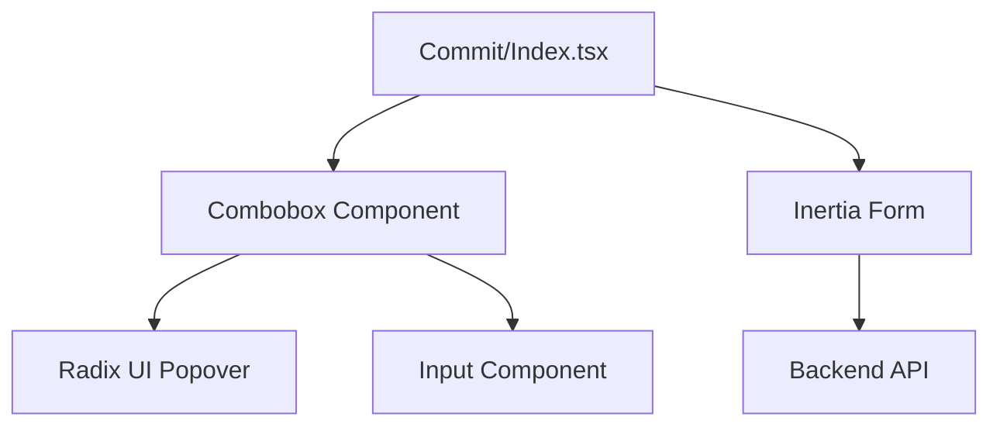
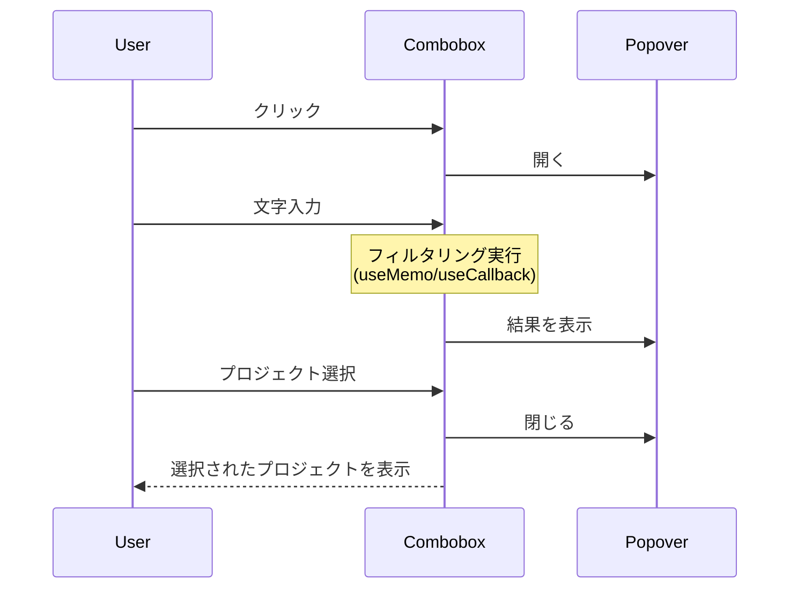

# Design Document

## Overview
この機能は、コミット収集画面でプロジェクトを選択する際に、文字を入力して絞り込める検索機能を提供します。大量のプロジェクトから目的のプロジェクトを素早く見つけることができるようになります。

**ユーザー**: コミット収集機能を使用するユーザーが、プロジェクト選択時に検索機能を利用します。

**影響**: 既存の `Select` コンポーネントを `Combobox` コンポーネントに置き換えることで、検索機能を追加します。既存のプロジェクト選択機能は維持されます。

### Goals
- プロジェクト選択時に文字を入力して検索できる機能を提供
- 入力した文字列でプロジェクト一覧をリアルタイムでフィルタリング
- 既存のプロジェクト選択機能（選択、バリデーション、フォーム送信）を維持
- 既存のデザインシステム（Tailwind CSS、Radix UI）との一貫性を保つ

### Non-Goals
- サーバー側での検索機能（クライアント側でのフィルタリングのみ）
- 仮想スクロール（現時点では不要、将来的に検討）
- アクセシビリティ要件（要件に含まれていない）
- パフォーマンス要件（要件に含まれていない）

## Architecture

### Existing Architecture Analysis
既存のシステムでは、Radix UI の `Select` コンポーネントを使用してプロジェクト選択を実装しています。`resources/js/pages/Commit/Index.tsx` で `Select` コンポーネントを使用し、`projects` プロップとしてプロジェクト一覧を受け取ります。既存の `Select` コンポーネント（`resources/js/components/ui/select.tsx`）は Radix UI の Select プリミティブをラップしたコンポーネントで、検索機能は実装されていません。

既存のパターン:
- Radix UI プリミティブをラップした UI コンポーネント
- `data-slot` 属性を使用したスタイリング
- Tailwind CSS クラスによるスタイリング
- TypeScript strict mode による型安全性

### Architecture Pattern & Boundary Map



**Architecture Integration**:
- **Selected pattern**: 新しい Combobox コンポーネントの作成（既存の Select コンポーネントの拡張ではなく）
- **Domain/feature boundaries**: `Combobox` コンポーネントは検索入力、フィルタリング、プロジェクト一覧の表示、選択処理を担当。`Commit/Index.tsx` はフォーム状態管理、バリデーションエラー表示、フォーム送信を担当
- **Existing patterns preserved**: Radix UI プリミティブをラップした UI コンポーネントパターン、`data-slot` 属性を使用したスタイリング、Tailwind CSS クラスによるスタイリング
- **New components rationale**: `Combobox` コンポーネントは検索機能を持つ独立したコンポーネントとして実装。既存の `Select` コンポーネントに影響を与えない
- **Steering compliance**: 既存のデザインシステム（Tailwind CSS、Radix UI）のパターンに従う。TypeScript strict mode による型安全性を維持

### Technology Stack

| Layer | Choice / Version | Role in Feature | Notes |
|-------|------------------|-----------------|-------|
| Frontend | React 19 | UI コンポーネントの実装 | 既存のスタック |
| Frontend | TypeScript 5.7 | 型安全性の確保 | 既存のスタック |
| Frontend | @radix-ui/react-popover | ドロップダウン表示 | 新規追加が必要 |
| Frontend | Tailwind CSS 4 | スタイリング | 既存のスタック |
| Frontend | Inertia.js 2.x | フォーム送信 | 既存のスタック |

## System Flows



**Key Decisions**:
- フィルタリングはリアルタイムで実行（入力と同時にフィルタリング）
- プロジェクト選択時に Popover を自動的に閉じる
- Escapeキーでの閉じる操作は Radix UI が自動的に処理

## Requirements Traceability

| Requirement | Summary | Components | Interfaces | Flows |
|-------------|---------|------------|------------|-------|
| 1.1 | プロジェクト選択フィールドクリック時に検索入力フィールドを表示 | Combobox | ComboboxProps | System Flow |
| 1.2 | 検索入力フィールドに文字を入力して保持 | Combobox | ComboboxProps | System Flow |
| 1.3 | 検索入力フィールドにフォーカスがある間、入力された文字列をリアルタイムで表示 | Combobox | ComboboxProps | System Flow |
| 1.4 | 検索入力フィールドに適切なプレースホルダーテキストを表示 | Combobox | ComboboxProps | - |
| 2.1 | 検索入力フィールドに文字を入力した際にプロジェクト一覧をフィルタリング | Combobox | ComboboxProps | System Flow |
| 2.2 | プロジェクト名に検索文字列が含まれるプロジェクトのみを表示 | Combobox | ComboboxProps | System Flow |
| 2.3 | 検索文字列が空の場合、すべてのプロジェクトを表示 | Combobox | ComboboxProps | System Flow |
| 2.4 | 検索文字列に一致するプロジェクトが存在しない場合、メッセージを表示 | Combobox | ComboboxProps | - |
| 2.5 | フィルタリングを大文字小文字を区別せずに実行 | Combobox | ComboboxProps | System Flow |
| 2.6 | フィルタリングを部分一致で実行 | Combobox | ComboboxProps | System Flow |
| 3.1 | フィルタリング結果からプロジェクトを選択した際に、選択されたプロジェクトのIDをフォームに設定 | Combobox, Commit/Index | ComboboxProps | System Flow |
| 3.2 | プロジェクトが選択された際に、選択されたプロジェクト名を表示 | Combobox | ComboboxProps | System Flow |
| 3.3 | プロジェクトが選択された際に、検索入力フィールドを閉じる | Combobox | ComboboxProps | System Flow |
| 3.4 | フォーム送信時に選択されたプロジェクトIDを正しく送信 | Commit/Index | - | - |
| 3.5 | プロジェクトが選択されていない状態でフォーム送信時にバリデーションエラーを表示 | Commit/Index | - | - |
| 3.6 | 既存のバリデーション機能を維持 | Commit/Index | - | - |
| 4.1 | 検索入力フィールドが表示される際に、プロジェクト一覧をドロップダウンまたはポップオーバー形式で表示 | Combobox, Popover | ComboboxProps | System Flow |
| 4.2 | 検索結果をスクロール可能なリストとして表示 | Combobox, Popover | ComboboxProps | - |
| 4.3 | 検索結果が多数ある場合、最大高さを設定し、スクロール可能にする | Combobox, Popover | ComboboxProps | - |
| 4.4 | 検索入力フィールドの外側をクリックした際に、検索結果を閉じる | Popover | - | - |
| 4.5 | Escapeキーを押した際に、検索結果を閉じる | Popover | - | - |
| 4.6 | 検索入力フィールドとプロジェクト一覧が既存のデザインシステムと一貫性を保つ | Combobox | ComboboxProps | - |
| 4.7 | 検索入力フィールドに適切なアイコンを表示 | Combobox | ComboboxProps | - |

## Components and Interfaces

| Component | Domain/Layer | Intent | Req Coverage | Key Dependencies (P0/P1) | Contracts |
|-----------|--------------|--------|--------------|--------------------------|-----------|
| Combobox | UI | 検索可能なセレクトコンポーネント | 1.1-1.4, 2.1-2.6, 3.1-3.3, 4.1-4.7 | Popover (P0), Input (P0) | State |
| Commit/Index | UI | コミット収集画面のページコンポーネント | 3.4-3.6 | Combobox (P0), Form (P0) | State |

### UI Layer

#### Combobox

| Field | Detail |
|-------|--------|
| Intent | 検索可能なセレクトコンポーネント。検索入力、フィルタリング、プロジェクト一覧の表示、選択処理を担当 |
| Requirements | 1.1-1.4, 2.1-2.6, 3.1-3.3, 4.1-4.7 |
| Owner / Reviewers | (optional) |

**Responsibilities & Constraints**
- 検索入力フィールドの表示と入力値の保持
- プロジェクト一覧のフィルタリング（大文字小文字を区別しない部分一致、`useMemo` または `useCallback` を使用）
- フィルタリング結果の表示（スクロール可能なリスト）
- プロジェクト選択処理と選択状態の表示（制御コンポーネントとして実装）
- Popover の開閉制御（クリック、Escapeキー）
- 空状態の表示（"該当するプロジェクトが見つかりません"）
- 既存のデザインシステム（Tailwind CSS、Radix UI）との一貫性

**Dependencies**
- Inbound: `Commit/Index.tsx` — プロジェクト一覧と選択状態の管理 (P0)
- Outbound: `Popover` (Radix UI) — ドロップダウン表示 (P0)
- Outbound: `Input` — 検索入力フィールド (P0)
- External: `@radix-ui/react-popover` — Popover プリミティブ (P0)

**Contracts**: State [✓]

##### Service Interface
```typescript
interface ComboboxProps {
  projects: CommitProject[];
  value?: string;
  onValueChange: (value: string) => void;
  placeholder?: string;
  aria-invalid?: boolean;
  required?: boolean;
  id?: string;
  className?: string;
}
```
- Preconditions: `projects` は空配列でない（空配列の場合は空状態を表示）
- Postconditions: プロジェクト選択時に `onValueChange` が呼び出され、選択されたプロジェクトのIDが渡される
- Invariants: `value` が `projects` 内のプロジェクトIDと一致するか、空文字列である

##### State Management
- **State model**: 
  - `open`: Popover の開閉状態（boolean、内部状態）
  - `searchValue`: 検索入力値（string、内部状態）
  - `value`: 選択されたプロジェクトのID（string、親コンポーネントから受け取る）
- **Persistence & consistency**: `value` は親コンポーネント（`Commit/Index.tsx`）で管理。`open` と `searchValue` は `Combobox` コンポーネント内で管理
- **Concurrency strategy**: 単一ユーザーの操作のみを想定

**Implementation Notes**
- **Integration**: Radix UI の `Popover` と既存の `Input` コンポーネントを組み合わせて実装。制御コンポーネントとして実装し、`value` と `onValueChange` プロップを受け取る
- **Filtering**: フィルタリングロジックは `useMemo` または `useCallback` を使用して `Combobox` コンポーネント内に実装。`projects` と `searchValue` に基づいてフィルタリング結果を計算
- **Validation**: 検索入力値のバリデーションは不要（任意の文字列を許可）
- **Risks**: 
  - `@radix-ui/react-popover` の追加インストールが必要
  - 既存の `Select` コンポーネントとの一貫性を保つ必要がある

#### Commit/Index

| Field | Detail |
|-------|--------|
| Intent | コミット収集画面のページコンポーネント。既存の `Select` を `Combobox` に置き換え |
| Requirements | 3.4-3.6 |
| Owner / Reviewers | (optional) |

**Responsibilities & Constraints**
- `Combobox` コンポーネントの統合
- フォーム状態管理（`projectId` state）
- バリデーションエラー表示（`errors.project_id`）
- フォーム送信処理

**Dependencies**
- Inbound: `Combobox` — プロジェクト選択 (P0)
- Outbound: `Form` (Inertia.js) — フォーム送信 (P0)

**Contracts**: State [✓]

##### State Management
- **State model**: 
  - `projectId`: 選択されたプロジェクトのID（string）
- **Persistence & consistency**: 既存の実装を維持
- **Concurrency strategy**: 既存の実装を維持

**Implementation Notes**
- **Integration**: 既存の `Select` コンポーネントを `Combobox` に置き換え
- **Validation**: 既存のバリデーション機能（`errors.project_id`）を維持
- **Risks**: 
  - 既存のフォーム送信処理への影響を確認する必要がある

## Data Models

### Domain Model
この機能は既存のデータモデルを使用します。新しいドメインモデルは導入しません。

- **CommitProject**: 既存の型定義（`resources/js/types/commit.d.ts`）
  - `id: number`
  - `name_with_namespace: string`

### Logical Data Model
既存のデータモデルを使用するため、新しい論理データモデルは不要です。

### Data Contracts & Integration

**API Data Transfer**
- 既存の API コントラクトを維持
- `CommitController::collectShow()` から `projects: CommitProject[]` を取得
- フィルタリングはクライアント側で実行（サーバーへのリクエストは不要）

## Error Handling

### Error Strategy
既存のエラーハンドリングパターンを維持します。

### Error Categories and Responses
**User Errors** (4xx): 
- プロジェクトが選択されていない状態でフォーム送信 → 既存のバリデーションエラー（`errors.project_id`）を表示

**System Errors** (5xx): 
- 既存のエラーハンドリングパターンを維持

### Monitoring
既存のモニタリングパターンを維持します。

## Testing Strategy

### Unit Tests
- `Combobox` コンポーネントのフィルタリングロジックのテスト
  - 大文字小文字を区別しない部分一致のテスト
  - 空文字列の場合のテスト
  - 一致するプロジェクトがない場合のテスト
- `Combobox` コンポーネントの選択処理のテスト
  - プロジェクト選択時の状態更新のテスト
  - Popover の開閉制御のテスト

### Integration Tests
- `Commit/Index.tsx` での `Combobox` コンポーネントの統合テスト
  - プロジェクト選択とフォーム送信のテスト
  - バリデーションエラーの表示テスト

### E2E/UI Tests
- コミット収集画面でのプロジェクト検索機能のテスト
  - 検索入力とフィルタリングのテスト
  - プロジェクト選択とフォーム送信のテスト
  - Escapeキーでの閉じる操作のテスト

## Supporting References
- `research.md`: 調査結果と設計決定の詳細
- `gap-analysis.md`: 実装ギャップ分析の結果
